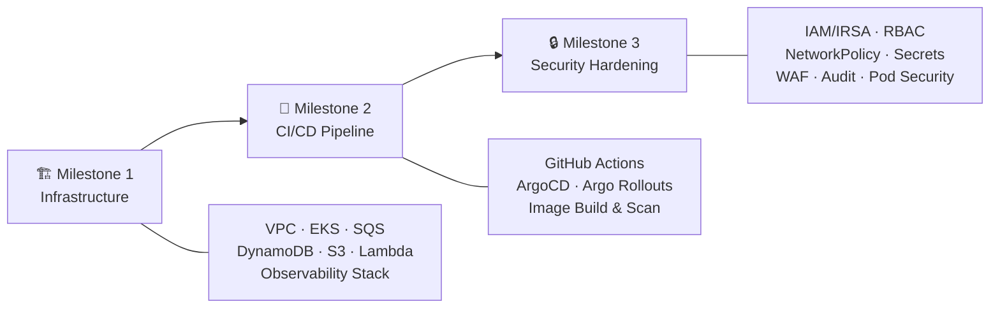

# 🚀 TF1 Triage Hub — Deployment Plan

> **Mục tiêu**: Mọi thành viên đều tự triển khai được toàn bộ hạ tầng, CI/CD, và security cho project TF1 Triage Hub.
> Plan chia thành **3 Milestone** theo đúng thứ tự deploy thực tế — milestone sau phụ thuộc vào milestone trước.

> [!IMPORTANT]
> **Đọc trước khi bắt đầu**: Mỗi task đều có phần "Kiểm tra" để tự verify. Nếu task trước chưa pass kiểm tra → KHÔNG chuyển sang task tiếp theo.
> [!NOTE]
> **Quy ước đặt tên & Region**: Các tên resource trong plan này (ví dụ `tf1-cdo05-tfstate`, `tf1-alert-queue`...) là tên gợi ý. Thành viên có thể tự đặt tên theo quy ước riêng của nhóm, miễn là **nhất quán** xuyên suốt các resource. Tuy nhiên, các giá trị sau là **bắt buộc theo AI Contract** và **KHÔNG được thay đổi**:
> - Region: `us-east-1`
> - AI Engine namespace: `tf1-aiops`
> - AI Engine service name: `tf1-ai-triage-engine`
> - AI Engine port: `8080`
> - Secret path: `tf1/ai-engine/service-auth-token`
> - Headers: `X-Tenant-Id`, `X-Correlation-Id`
> - Endpoints: `/healthz`, `/v1/triage`

---

## Tổng quan 3 Milestone



| Milestone | Nội dung chính | Phụ thuộc |
|-----------|---------------|-----------|
| **M1 — Infrastructure** | Tạo toàn bộ hạ tầng AWS + K8s base | Không |
| **M2 — CI/CD Pipeline** | Pipeline build/test/scan/deploy tự động | M1 hoàn thành |
| **M3 — Security Hardening** | Bảo mật toàn diện + audit trail | M1 + M2 hoàn thành |

---

## Tài liệu tham khảo

| Tài liệu | Đường dẫn | Dùng cho |
|-----------|----------|----------|
| Infra Design | [02_infra_design.md](file:///home/nguyendkhanhhung/Documents/Xbrain-intern/nguyendkhanhhung-aws-accelerator-p2/xbrain-capstone-cdo5/docs/02_infra_design.md) | M1 |
| Security Design | [03_security_design.md](file:///home/nguyendkhanhhung/Documents/Xbrain-intern/nguyendkhanhhung-aws-accelerator-p2/xbrain-capstone-cdo5/docs/03_security_design.md) | M3 |
| Deployment Design | [04_deployment_design.md](file:///home/nguyendkhanhhung/Documents/Xbrain-intern/nguyendkhanhhung-aws-accelerator-p2/xbrain-capstone-cdo5/docs/04_deployment_design.md) | M2 |
| W9 — GitOps + Canary | [W9_phase2_announcement_cloud.md](file:///home/nguyendkhanhhung/Documents/Xbrain-intern/xbrain-learners/W9/W9_phase2_announcement_cloud.md) | M2 |
| W10 — RBAC + Secrets + Platform | [W10_phase2_announcement_cloud.md](file:///home/nguyendkhanhhung/Documents/Xbrain-intern/xbrain-learners/W10/W10_phase2_announcement_cloud.md) | M2 + M3 |
| Requirements | [01_requirements_analysis.md](file:///home/nguyendkhanhhung/Documents/Xbrain-intern/nguyendkhanhhung-aws-accelerator-p2/xbrain-capstone-cdo5/docs/01_requirements_analysis.md) | Tất cả |

---

# 🏗️ Milestone 1 — Infrastructure

> Tạo toàn bộ hạ tầng AWS bằng Terraform + deploy observability stack lên EKS.
> Kết thúc milestone này: có 1 EKS cluster chạy được, có VPC, có queue, có database, có storage.

---

### Task 1.1 — Terraform State Backend

**Mục đích**: Tạo nơi lưu trữ Terraform state an toàn, cho phép nhiều người cùng chạy Terraform mà không conflict.

**Làm gì**:
1. Tạo S3 bucket `tf1-cdo05-tfstate` ở region `us-east-1` _(tên bucket tự chọn, region bắt buộc theo contract)_
   - Bật versioning (để rollback state nếu lỗi)
   - Bật server-side encryption (SSE-S3 cho dev, SSE-KMS cho prod)
   - Block all public access
2. Tạo DynamoDB table `tf1-cdo05-tflock` _(tên table tự chọn)_
   - Partition key: `LockID` (String)
   - Dùng để lock state — tránh 2 người chạy `terraform apply` cùng lúc
3. Cấu hình `backend.tf`:
   ```hcl
   terraform {
     backend "s3" {
       bucket         = "tf1-cdo05-tfstate"
       key            = "sandbox/terraform.tfstate"   # thay sandbox/staging/prod tùy env
       region         = "us-east-1"
       dynamodb_table = "tf1-cdo05-tflock"
       encrypt        = true
     }
   }
   ```

**Kiểm tra**:
- [x] `terraform init` thành công, không báo lỗi backend
- [x] S3 bucket tồn tại trên AWS Console, versioning = Enabled
- [x] DynamoDB table tồn tại, có key `LockID`

---

### Task 1.2 — VPC & Networking

**Mục đích**: Tạo mạng riêng (VPC) cho toàn bộ hạ tầng. Mọi service sẽ nằm trong VPC này.

**Làm gì** (module `modules/networking/`):
1. **VPC**: CIDR block _(tự chọn, ví dụ `10.0.0.0/16`)_
2. **Subnets** — 3 Availability Zones, mỗi AZ có:
   - 1 **Public subnet**: chứa ALB, NAT Gateway
   - 1 **Private subnet**: chứa EKS nodes, Lambda ENI, tất cả workload
3. **Internet Gateway**: cho public subnets ra internet
4. **NAT Gateway**: cho private subnets gọi ra ngoài (Jira API, Slack API, pull Docker images)
5. **Route Tables**:
   - Public: `0.0.0.0/0` → Internet Gateway
   - Private: `0.0.0.0/0` → NAT Gateway
6. **VPC Endpoints** (PrivateLink) — giúp gọi AWS services mà không qua internet:
   - `com.amazonaws.{region}.s3` (Gateway)
   - `com.amazonaws.{region}.dynamodb` (Gateway)
   - `com.amazonaws.{region}.sqs` (Interface)
   - `com.amazonaws.{region}.ecr.api` + `ecr.dkr` (Interface)
   - `com.amazonaws.{region}.logs` (Interface — CloudWatch Logs)
   - `com.amazonaws.{region}.sts` (Interface — cho IRSA)
   - `com.amazonaws.{region}.secretsmanager` (Interface)

**Tại sao cần VPC Endpoints?**
> Nếu không có VPC Endpoint, mọi request từ private subnet đến S3/DynamoDB/SQS sẽ đi qua NAT Gateway → tốn tiền NAT Gateway data processing. VPC Endpoint giúp traffic đi trực tiếp trong mạng AWS, nhanh hơn và rẻ hơn.

**Kiểm tra**:
- [x] VPC hiện trên AWS Console, CIDR đúng
- [x] 3 public + 3 private subnets, mỗi cái ở AZ khác nhau
- [x] NAT Gateway hoạt động (test: launch 1 EC2 ở private subnet, `curl google.com` thành công)
- [x] VPC Endpoints hiện trên Console

---

### Task 1.3 — Security Groups

**Mục đích**: Tạo tường lửa (firewall rules) cho từng loại resource.

**Làm gì**:

| Security Group | Inbound | Outbound | Gắn vào |
|---|---|---|---|
| `sg-alb` | TCP 443 từ `0.0.0.0/0` | TCP tới `sg-eks-nodes` | Application Load Balancer |
| `sg-eks-nodes` | TCP từ `sg-alb` (app ports) + TCP từ EKS control plane | All outbound (qua NAT/VPC Endpoints) | EKS managed node group |
| `sg-lambda` | Không (Lambda outbound only) | TCP tới SQS/DynamoDB/S3 VPC Endpoints | Lambda ENI |
| `sg-vpc-endpoints` | TCP 443 từ `sg-eks-nodes` + `sg-lambda` | — | VPC Interface Endpoints |

**Kiểm tra**:
- [x] Mỗi SG tồn tại trên Console, rules đúng như bảng trên
- [x] Không có SG nào mở `0.0.0.0/0` cho port ngoài 443

---

### Task 1.4 — EKS Cluster & Node Groups

**Mục đích**: Tạo Kubernetes cluster — nơi chạy toàn bộ ứng dụng.

**Làm gì** (module `modules/compute/`):
1. **EKS Cluster**:
   - Kubernetes version: 1.30+ (hoặc latest stable)
   - Đặt trong private subnets
   - Enable OIDC provider (bắt buộc cho IRSA ở M3)
   - Enable EKS audit logging → CloudWatch Logs
2. **Managed Node Group**:
   - Instance type: _(tự chọn, ví dụ `t3.medium` hoặc `t3.large` tùy budget)_
   - Desired: 2, Min: 2, Max: 4
   - Đặt trong private subnets
   - Node group role với các policy: `AmazonEKSWorkerNodePolicy`, `AmazonEKS_CNI_Policy`, `AmazonEC2ContainerRegistryReadOnly`
3. **Add-ons**:
   - `vpc-cni` (networking cho pods)
   - `coredns` (DNS trong cluster)
   - `kube-proxy` (network routing)
   - `aws-ebs-csi-driver` (nếu cần persistent volumes)
4. **AWS Load Balancer Controller** (Helm chart):
   - Quản lý ALB tự động khi tạo K8s Ingress resource
   - Cần IRSA role riêng

**Kiểm tra**:
- [x] `aws eks describe-cluster --name <tên-cluster-của-bạn>` trả về status `ACTIVE`
- [x] `kubectl get nodes` thấy nodes `Ready`
- [x] `kubectl get pods -n kube-system` — tất cả pods Running
- [x] AWS Load Balancer Controller pod Running trong `kube-system`

---

### Task 1.5 — SQS FIFO Queue & DLQ

**Mục đích**: Tạo hàng đợi tin nhắn cho alert pipeline. Alert đi vào queue → worker xử lý. Nếu xử lý thất bại nhiều lần → chuyển vào DLQ để review.

**Làm gì**:
1. **SQS FIFO Queue** `tf1-alert-queue.fifo` _(tên queue tự chọn, nhưng phải có đuôi `.fifo`)_:
   - FIFO (đảm bảo thứ tự + exactly-once processing)
   - Visibility timeout: 300s (thời gian worker xử lý 1 message)
   - Message retention: 4 days
   - Content-based deduplication: Enabled
   - SSE encryption: Enabled (SSE-SQS hoặc SSE-KMS)
   - Redrive policy: maxReceiveCount = 3 → chuyển sang DLQ
2. **SQS FIFO DLQ** `tf1-alert-dlq.fifo` _(tên DLQ tự chọn, phải có đuôi `.fifo`)_:
   - FIFO (cùng loại với queue chính)
   - Message retention: 14 days (giữ lâu hơn để debug)
   - SSE encryption: Enabled

**Tại sao FIFO mà không phải Standard?**
> FIFO đảm bảo mỗi alert chỉ xử lý đúng 1 lần (exactly-once), tránh tạo duplicate Jira ticket. Standard queue có thể deliver message nhiều lần.

**Kiểm tra**:
- [x] Queue hiện trên SQS Console, type = FIFO
- [x] DLQ hiện trên Console, type = FIFO
- [x] Test gửi 1 message vào queue → nhận được message → delete → không nhận lại
- [x] CloudWatch alarm cho DLQ `ApproximateNumberOfMessagesVisible > 0`

---

### Task 1.6 — DynamoDB Tables

**Mục đích**: Tạo database cho workflow state — lưu trạng thái xử lý incident, tránh xử lý trùng.

**Làm gì** (module `modules/data/`):
1. **Table `incident_state`** _(tên table tự chọn)_:
   - Partition key: `incident_id` (String)
   - Sort key: không cần (hoặc `correlation_key` nếu cần query theo correlation)
   - GSI trên `correlation_key` + `alert_fingerprint` (để query nhanh theo correlation)
   - On-demand capacity mode (auto-scale, trả theo request)
   - TTL attribute: `expires_at` (tự xóa record cũ sau 30-90 ngày)
   - Point-in-time recovery: Enabled
   - SSE encryption: Enabled

**Các field quan trọng**:
```
incident_id, correlation_key, alert_fingerprint, tenant_id,
status, current_step, retry_count, last_error,
jira_ticket_id, slack_thread_id,
s3_raw_alert_uri, s3_ai_request_uri, s3_ai_response_uri, s3_rca_report_uri,
created_at, updated_at, expires_at
```

**Kiểm tra**:
- [x] Table hiện trên DynamoDB Console
- [x] `aws dynamodb describe-table --table-name incident_state` thành công
- [x] TTL enabled trên attribute `expires_at`
- [x] Test PutItem + GetItem thành công

---

### Task 1.7 — S3 Buckets

**Mục đích**: Tạo nơi lưu trữ artifacts — raw alert payloads, AI request/response, RCA reports, Jira/Slack payloads.

**Làm gì**:
1. **Bucket `tf1-audit-{account-id}`** _(tên bucket tự chọn, phải globally unique)_:
   - Versioning: Enabled
   - Block all public access: Enabled
   - Server-side encryption: SSE-S3 (dev) / SSE-KMS (prod)
   - Bucket policy: deny non-TLS requests (`aws:SecureTransport = false`)
   - Lifecycle rule: transition to Glacier after 90 days (nếu cần tiết kiệm)
   - Object key format: `{tenant_id}/{service}/{incident_id}/{artifact_type}`

2. **Bucket policy mẫu** (deny non-HTTPS):
   ```json
   {
     "Effect": "Deny",
     "Principal": "*",
     "Action": "s3:*",
     "Resource": ["arn:aws:s3:::tf1-audit-*", "arn:aws:s3:::tf1-audit-*/*"],
     "Condition": {
       "Bool": { "aws:SecureTransport": "false" }
     }
   }
   ```

**Kiểm tra**:
- [x] Bucket tồn tại, Block Public Access = On
- [x] Versioning = Enabled
- [x] Test upload 1 file → download thành công
- [x] Test access qua HTTP (không HTTPS) → bị deny

---

### Task 1.8 — Lambda Functions

**Mục đích**: Tạo 2 Lambda functions — thin adapters cho alert ingestion và Jira/Slack integration.

**Làm gì**:
1. **Ingest Lambda** (`tf1-ingest-lambda`) _(tên function tự chọn)_:
   - Runtime: Python 3.12 / Node.js 20
   - Trigger: API Gateway hoặc Function URL (nhận webhook từ Alertmanager)
   - Logic: validate payload → normalize → push to SQS FIFO
   - IAM Role: `tf1-ingest-lambda-role` (chi tiết ở M3)
   - VPC: đặt trong private subnet (nếu cần gọi VPC Endpoint SQS)
   - Timeout: 30s, Memory: 256MB
   - Environment variables: `SQS_QUEUE_URL`, `ENVIRONMENT`

2. **Integration Lambda** (`tf1-integration-lambda`) _(tên function tự chọn)_:
   - Runtime: Python 3.12 / Node.js 20
   - Trigger: invoked bởi CDO Correlator Worker (async invoke hoặc qua SQS)
   - Logic: tạo/update Jira ticket + gửi Slack notification
   - IAM Role: `tf1-integration-role`
   - Cần access: DynamoDB (đọc incident state), S3 (đọc RCA report), Secrets Manager (Jira token, Slack webhook)

**Kiểm tra**:
- [x] Cả 2 Lambda functions tồn tại trên Console
- [x] Test invoke Ingest Lambda với sample alert payload → message xuất hiện trong SQS
- [x] CloudWatch Logs group tồn tại cho mỗi Lambda

---

### Task 1.9 — Observability Stack trên EKS

**Mục đích**: Deploy monitoring tools lên EKS cluster để theo dõi toàn bộ hệ thống.

> [!TIP]
> Phần này team đã làm ở W9. Tham khảo lại W9 lab để setup nhanh hơn.

**Làm gì** (deploy bằng Helm charts):
1. **Prometheus** (kube-prometheus-stack):
   - ServiceMonitor cho các ứng dụng
   - PodMonitor cho sidecar
   - PrometheusRule cho alerting rules
   - Retention: 7 ngày (dev), 15 ngày (staging)
2. **Grafana**:
   - Datasource: Prometheus + Loki
   - Dashboards: SLO, cost tracking, AI health, SQS depth, Lambda errors
   - **KHÔNG expose public** — chỉ access qua `kubectl port-forward` hoặc VPN
3. **Loki** (+ Promtail hoặc Grafana Alloy):
   - Thu thập logs từ tất cả pods
   - Label-based querying (tenant_id, namespace, service)
4. **Alertmanager**:
   - Route: critical → Slack + PagerDuty, warning → Slack
   - Grouping: theo `alertname`, `namespace`, `service`
   - Inhibition rules: critical suppress warning cho cùng service
   - Webhook → Ingest Lambda (cho TF1 pipeline)

**Kiểm tra**:
- [ ] `kubectl get pods -n monitoring` _(namespace tự chọn)_ — tất cả Running
- [ ] Grafana accessible qua port-forward, dashboards hiện data
- [ ] Prometheus targets page — tất cả targets UP
- [ ] Alertmanager accessible, routing rules đúng
- [ ] Gửi 1 test alert → verify Alertmanager nhận được

---

### Task 1.10 — CloudWatch Monitoring

**Mục đích**: Giám sát AWS managed services (Lambda, SQS, DynamoDB) — những thứ nằm ngoài EKS.

**Làm gì** (module `modules/observability/`):
1. **CloudWatch Alarms**:

   | Alarm | Metric | Threshold | Action |
   |-------|--------|-----------|--------|
   | Lambda Errors | `Errors` | > 5 trong 5 phút | SNS → Slack |
   | Lambda Duration | `Duration` | p99 > 10s | SNS → Slack |
   | SQS Queue Depth | `ApproximateNumberOfMessagesVisible` | > 100 | SNS → Slack |
   | SQS DLQ Count | `ApproximateNumberOfMessagesVisible` | > 0 | SNS → Slack (CRITICAL) |
   | DynamoDB Throttles | `ThrottledRequests` | > 0 | SNS → Slack |
   | S3 Errors | `4xxErrors` + `5xxErrors` | > 10 | SNS → Slack |

2. **SNS Topic** `tf1-alerts` → subscribe Slack webhook
3. **CloudWatch Log Groups** cho Lambda functions (auto-created nhưng set retention: 14 days)

**Kiểm tra**:
- [x] Tất cả alarms hiện trên CloudWatch Console, state = OK
- [x] Test trigger 1 alarm (ví dụ: send message to DLQ) → verify Slack nhận notification
- [x] Log Groups tồn tại, retention đúng

---

### ✅ Milestone 1 — Definition of Done

Tất cả các điều kiện sau phải đạt trước khi chuyển sang Milestone 2:

- [x] Terraform state hoạt động, nhiều người `plan` cùng lúc không conflict
- [x] VPC + subnets + NAT Gateway + VPC Endpoints hoạt động
- [x] EKS cluster `ACTIVE`, nodes `Ready`, pods trong `kube-system` Running
- [x] SQS FIFO queue + DLQ tồn tại, test send/receive OK
- [x] DynamoDB table tồn tại, test CRUD OK
- [x] S3 bucket tồn tại, block public access, deny non-TLS
- [x] Lambda functions deploy được, test invoke OK
- [ ] Prometheus + Grafana + Loki + Alertmanager chạy trên EKS
- [x] CloudWatch alarms cấu hình đúng, SNS → Slack hoạt động

---

# 🔄 Milestone 2 — CI/CD Pipeline

> Thiết lập pipeline tự động: push code → build → test → scan → deploy lên EKS.
> Dựa trên kiến thức W9 (GitOps + Canary) và W10 (RBAC + Secrets + Platform Integration).

> [!NOTE]
> **Kiến thức nền**: Team đã học và thực hành ở W9/W10:
> - GitHub Actions workflows (plan-on-PR, apply-on-merge)
> - ArgoCD setup, App of Apps pattern, sync waves
> - Argo Rollouts canary với AnalysisTemplate
> - Trivy image scanning, Gitleaks secret scanning
> 
> Milestone này **áp dụng** kiến thức đó vào project thật.

---

### Task 2.1 — Repository Structure

**Mục đích**: Tổ chức repo theo chuẩn GitOps — tách source code và K8s manifests.

**Làm gì**:
1. **App Repository** (source code):
   ```
   app-repo/
   ├── .github/workflows/        # CI pipelines
   │   ├── ci-build-test.yml     # Build + Test + Scan
   │   ├── ci-terraform.yml      # Terraform plan/apply
   │   └── ci-image-sign.yml     # Image signing
   ├── services/
   │   ├── ingest-lambda/
   │   ├── correlator-worker/
   │   ├── ai-engine/
   │   └── integration-lambda/
   ├── terraform/
   │   ├── modules/
   │   ├── environments/
   │   │   ├── sandbox/
   │   │   ├── staging/
   │   │   └── prod/
   │   └── backend.tf
   └── Makefile
   ```

2. **Config Repository** (GitOps manifests):
   ```
   config-repo/
   ├── argocd/
   │   ├── app-of-apps.yaml
   │   └── projects/
   ├── base/                     # Kustomize base
   │   ├── namespaces/
   │   ├── rbac/
   │   ├── deployments/
   │   ├── services/
   │   ├── ingress/
   │   ├── external-secrets/
   │   └── network-policies/
   └── overlays/                 # Kustomize overlays per env
       ├── sandbox/
       ├── staging/
       └── prod/
   ```

**Kiểm tra**:
- [ ] Cả 2 repos tồn tại trên GitHub
- [ ] Branch protection rules: `main` cần PR + review, `develop` cần PR
- [ ] Folder structure đúng như trên

---

### Task 2.2 — GitHub Actions CI Pipeline

**Mục đích**: Mỗi khi push code hoặc mở PR, pipeline tự động chạy build, test, scan.

> [!TIP]
> Tham khảo W9 Day 1 — GitHub Actions workflows đã làm.

**Làm gì** — file `.github/workflows/ci-build-test.yml`:

```yaml
# Luồng xử lý:
# 1. Developer push code / mở PR
# 2. GitHub Actions trigger
# 3. Build Docker image
# 4. Chạy unit tests + integration tests
# 5. Scan image bằng Trivy (tìm CVE)
# 6. Scan secrets bằng Gitleaks
# 7. Push image lên ECR (nếu pass tất cả)
# 8. Update image tag trong config-repo (trigger ArgoCD sync)
```

**Quality Gates** (pipeline FAIL nếu không đạt):

| Gate | Tool | Threshold |
|------|------|-----------|
| Test coverage | pytest / Jest | ≥ 70% |
| Test pass rate | pytest / Jest | 100% |
| Image vulnerabilities | Trivy | 0 CRITICAL, 0 HIGH |
| Secret leaks | Gitleaks | 0 findings |

**CI Authentication** (KHÔNG dùng static keys):
- GitHub OIDC → AWS IAM assume-role
- Role TTL: 15 phút
- Scope: chỉ push ECR + read Terraform state

**Kiểm tra**:
- [ ] Push code → pipeline tự động chạy
- [ ] PR hiện kết quả CI (pass/fail) trước khi merge
- [ ] Image xuất hiện trên ECR sau khi CI pass
- [ ] Test thử commit 1 file có secret → Gitleaks block

---

### Task 2.3 — Terraform CI/CD Pipeline

**Mục đích**: Infra changes cũng phải qua review trước khi apply.

**Làm gì** — file `.github/workflows/ci-terraform.yml`:

```
PR opened/updated (terraform/ changed)
  → terraform fmt -check
  → terraform validate
  → terraform plan
  → Post plan output as PR comment
  → Reviewer approve
  → Merge to develop → auto-apply sandbox
  → Merge to main → manual approval → apply prod
```

**Branch → Environment mapping**:

| Branch | Environment | Apply mode |
|--------|-------------|------------|
| `feat/*`, `bugfix/*` | sandbox | Auto (trên PR merge) |
| `develop`, `release/*`, `hotfix/*` | staging | Auto |
| `main` | prod | Manual approval required |

**Kiểm tra**:
- [ ] Mở PR thay đổi Terraform → plan output hiện trên PR comment
- [ ] Merge vào `develop` → sandbox resources tự động update
- [ ] Merge vào `main` → cần approve trên GitHub Actions UI

---

### Task 2.4 — ArgoCD Setup

**Mục đích**: ArgoCD theo dõi config-repo, tự động deploy K8s manifests lên cluster khi có thay đổi.

> [!TIP]
> Tham khảo W9 Day 1 — ArgoCD App of Apps đã setup.

**Làm gì**:
1. **Install ArgoCD** trên EKS (Helm chart):
   ```bash
   helm repo add argo https://argoproj.github.io/argo-helm
   helm install argocd argo/argo-cd -n argocd --create-namespace
   ```

2. **App of Apps** — 1 root Application quản lý tất cả:
   ```yaml
   apiVersion: argoproj.io/v1alpha1
   kind: Application
   metadata:
     name: tf1-root
     namespace: argocd
   spec:
     project: default
     source:
       repoURL: https://github.com/org/config-repo.git
       targetRevision: HEAD
       path: argocd/
     destination:
       server: https://kubernetes.default.svc
     syncPolicy:
       automated:
         prune: true        # Xóa resource không còn trong Git
         selfHeal: true      # Tự sửa drift
   ```

3. **Sync Waves** (thứ tự deploy):

   | Wave | Resources | Lý do |
   |------|-----------|-------|
   | 0 | Namespaces, RBAC, ExternalSecrets, ConfigMaps | Foundation — phải có trước |
   | 1 | Demo App Deployments, Services, ALB Ingress, Ingest Lambda config, SQS config | Platform services |
   | 2 | AI Engine (Argo Rollout Canary) | Cần platform sẵn sàng |
   | 3 | AIOps Worker (CDO Correlator) | Cần AI Engine URL |
   | 4 | Observability (Prometheus, Alertmanager, Loki, Grafana), Integration Lambda config | Cuối cùng |

4. **Kustomize Overlays** per environment:
   - `base/`: deployment template chung
   - `overlays/sandbox/`: replicas=1, resource limits thấp
   - `overlays/staging/`: replicas=2, resource limits trung bình
   - `overlays/prod/`: replicas=2-6 (HPA), resource limits cao, manual sync

**Kiểm tra**:
- [ ] ArgoCD UI accessible (port-forward)
- [ ] Root Application hiện trên UI, status = Healthy + Synced
- [ ] Tất cả child Applications hiện đúng thứ tự sync waves
- [ ] Thay đổi 1 file trong config-repo → ArgoCD tự sync trong ≤ 3 phút
- [ ] Test xóa 1 deployment bằng kubectl → ArgoCD tự heal lại

---

### Task 2.5 — Argo Rollouts (Canary Deployment)

**Mục đích**: Deploy AI Engine bằng canary — chuyển traffic dần dần, tự rollback nếu có lỗi.

> [!TIP]
> Tham khảo W9 Day 3 — Argo Rollouts + AnalysisTemplate đã setup.

**Làm gì**:
1. **Install Argo Rollouts**:
   ```bash
   helm install argo-rollouts argo/argo-rollouts -n argo-rollouts --create-namespace
   ```

2. **Rollout CRD** cho AI Engine:
   ```yaml
   apiVersion: argoproj.io/v1alpha1
   kind: Rollout
   metadata:
     name: ai-engine
   spec:
     strategy:
       canary:
         steps:
           - setWeight: 10      # 10% traffic
           - pause: {duration: 5m}
           - analysis:
               templates:
                 - templateName: ai-engine-health
           - setWeight: 50      # 50% traffic
           - pause: {duration: 5m}
           - analysis:
               templates:
                 - templateName: ai-engine-health
           # Nếu pass → tự lên 100%
   ```

3. **AnalysisTemplate** — auto-check metrics:
   ```yaml
   apiVersion: argoproj.io/v1alpha1
   kind: AnalysisTemplate
   metadata:
     name: ai-engine-health
   spec:
     metrics:
       - name: error-rate
         provider:
           prometheus:
             address: http://prometheus.monitoring:9090
             query: |
               sum(rate(http_requests_total{service="ai-engine",code=~"5.."}[5m]))
               / sum(rate(http_requests_total{service="ai-engine"}[5m]))
         successCondition: result[0] < 0.005    # < 0.5%
         failureLimit: 3
       - name: p99-latency
         provider:
           prometheus:
             address: http://prometheus.monitoring:9090
             query: |
               histogram_quantile(0.99, sum(rate(http_request_duration_seconds_bucket{service="ai-engine"}[5m])) by (le))
         successCondition: result[0] < 1.0       # < 1000ms
         failureLimit: 3
   ```

4. **Rolling Update** cho Platform Service (non-AI):
   ```yaml
   strategy:
     type: RollingUpdate
     rollingUpdate:
       maxUnavailable: 0    # Không bao giờ mất pod
       maxSurge: 1          # Thêm 1 pod mới trước khi xóa cũ
   ```

**Kiểm tra**:
- [ ] `kubectl argo rollouts list rollouts -n ai-engine` hiện rollout
- [ ] Deploy version mới → traffic chuyển 10% → 50% → 100%
- [ ] Test deploy version lỗi (return 500) → auto-abort + rollback
- [ ] Rollback RTO < 60s

---

### Task 2.6 — Image Build & Registry

**Mục đích**: Build Docker images, push lên ECR, đảm bảo image an toàn.

**Làm gì**:
1. **ECR Repositories** (tạo bằng Terraform):
   - `tf1/ingest-lambda`
   - `tf1/correlator-worker`
   - `tf1/ai-engine`
   - `tf1/integration-lambda`
   - Image scanning: Enabled (ECR native scan)
   - Image tag immutability: Enabled (không cho overwrite tag)
   - Lifecycle policy: giữ 10 images gần nhất, xóa untagged sau 7 ngày

2. **Image tagging convention**:
   ```
   {account}.dkr.ecr.{region}.amazonaws.com/tf1/{service}:{git-sha-short}
   ```
   - Dùng git SHA, KHÔNG dùng `latest`
   - Mỗi build tạo 1 tag mới, immutable

3. **Trivy scan trong CI** (đã config ở Task 2.2):
   ```bash
   trivy image --severity CRITICAL,HIGH --exit-code 1 $IMAGE_URI
   ```

**Kiểm tra**:
- [ ] ECR repos tồn tại trên Console
- [ ] CI push image thành công, tag = git SHA
- [ ] Image tag immutability hoạt động (push cùng tag → fail)
- [ ] ECR scan results hiện trên Console

---

### ✅ Milestone 2 — Definition of Done

- [ ] Push code → CI pipeline tự động build + test + scan
- [ ] PR hiện CI status (pass/fail), Terraform plan comment
- [ ] ArgoCD quản lý tất cả K8s resources, auto-sync hoạt động
- [ ] Canary deployment hoạt động cho AI Engine (10% → 50% → 100%)
- [ ] Auto-rollback hoạt động khi metrics vượt threshold
- [ ] Image push lên ECR với git SHA tag, Trivy scan pass
- [ ] Branch strategy hoạt động: feature → sandbox, develop → staging, main → prod

---

# 🔒 Milestone 3 — Security Hardening

> Bảo mật toàn diện: IAM least privilege, secrets management, network isolation, audit trail.
> Dựa trên [03_security_design.md](file:///home/nguyendkhanhhung/Documents/Xbrain-intern/nguyendkhanhhung-aws-accelerator-p2/xbrain-capstone-cdo5/docs/03_security_design.md).

> [!NOTE]
> **Kiến thức nền**: Team đã học ở W10:
> - RBAC (Roles, RoleBindings, ClusterRoles)
> - OPA/Gatekeeper constraint templates
> - External Secrets Operator (ESO)
> - Cosign image signing
> 
> Milestone này **mở rộng** kiến thức đó cho production-grade security.

---

### Task 3.1 — IAM Roles & IRSA

**Mục đích**: Mỗi workload có IAM role riêng, chỉ có quyền tối thiểu cần thiết (Least Privilege). Pods nhận credentials qua IRSA — không dùng node role hoặc static keys.

**IRSA là gì?**
> IRSA (IAM Roles for Service Accounts) = gắn IAM role vào K8s ServiceAccount. Khi pod dùng ServiceAccount đó, nó tự nhận temporary credentials, chỉ có quyền của role đó. Các pod khác trên cùng node KHÔNG share quyền.

**Làm gì**:

| Role | Gắn vào | Quyền chính |
|------|---------|-------------|
| `tf1-ingest-lambda-role` | Ingest Lambda | `sqs:SendMessage` trên queue cụ thể, `secretsmanager:GetSecretValue` cho webhook signing key |
| `tf1-correlator-worker-role` | K8s SA `cdo-correlator-worker` (IRSA) | `sqs:Receive/Delete/ChangeVisibility`, `dynamodb:Get/Put/Update/Query`, `s3:Get/Put/List` (prefix-scoped), KMS Decrypt |
| `tf1-ai-engine-role` | K8s SA `ai-engine` (IRSA) | `s3:GetObject` (evidence), optional `bedrock:InvokeModel`, `secretsmanager:GetSecretValue` |
| `tf1-integration-role` | Integration Lambda | `dynamodb:GetItem/UpdateItem`, `s3:Get/Put`, `secretsmanager:GetSecretValue` (Jira/Slack tokens) |
| `tf1-observability-query-role` | Evidence proxy (IRSA) | Read-only Prometheus/Loki/CloudWatch, scoped by tenant |
| CI/CD deploy role | GitHub Actions (OIDC) | Deploy IaC, push ECR, assume per-environment |

**Cách tạo IRSA**:
```bash
# 1. Tạo K8s ServiceAccount
kubectl create sa cdo-correlator-worker -n tf1-aiops

# 2. Annotate với IAM role ARN
kubectl annotate sa cdo-correlator-worker -n tf1-aiops \
  eks.amazonaws.com/role-arn=arn:aws:iam::ACCOUNT:role/tf1-correlator-worker-role

# 3. Pod spec sử dụng serviceAccountName: cdo-correlator-worker
```

**Kiểm tra**:
- [ ] Mỗi role tồn tại trên IAM Console, policy đúng
- [ ] Pod chạy với IRSA → `aws sts get-caller-identity` trong pod trả về đúng role
- [ ] Pod KHÔNG thể access resource ngoài scope (ví dụ: correlator worker không thể `s3:DeleteBucket`)
- [ ] Restrict IMDS: pods không access instance metadata trực tiếp

---

### Task 3.2 — Kubernetes RBAC

**Mục đích**: Giới hạn quyền truy cập K8s resources cho từng role trong team.

> [!TIP]
> Tham khảo W10 Day 1 — RBAC roles đã setup.

**Làm gì**:

| K8s Role | Namespace | Quyền | Dùng cho |
|----------|-----------|-------|----------|
| `developer` | `triage-hub-*` | get/list/watch pods, logs, events; create port-forward | Team dev xem app |
| `sre` | `triage-hub-*`, `monitoring` | Tất cả của developer + restart pods, scale deployments | Ops team |
| `viewer` | tất cả | get/list/watch only | Stakeholders |
| `cdo-correlator-worker` SA | `tf1-aiops` | get/list/watch pods (chỉ namespace `tf1-aiops`) | Worker pod |

**Quan trọng — KHÔNG cho phép**:
- ❌ `secrets get/list` (secrets chỉ mount qua ESO)
- ❌ `pods/exec` (không exec vào pod production)
- ❌ `cluster-admin` cho bất kỳ ai ngoài break-glass
- ❌ `create/delete` namespaces bởi developer role

**Kiểm tra**:
- [ ] `kubectl auth can-i --as=developer get pods -n triage-hub-sandbox` → yes _(namespace tự chọn)_
- [ ] `kubectl auth can-i --as=developer delete deployments -n triage-hub-prod` → no
- [ ] `kubectl auth can-i --as=developer get secrets -n triage-hub-prod` → no

---

### Task 3.3 — Secrets Management (ESO)

**Mục đích**: Secrets lưu trong AWS Secrets Manager, sync vào K8s bằng External Secrets Operator. KHÔNG hardcode secrets trong code, Helm values, hay K8s manifests.

> [!TIP]
> Tham khảo W10 Day 2 — ESO đã setup.

**Làm gì**:
1. **Tạo secrets trong AWS Secrets Manager**:

   | Secret Name | Nội dung | Rotation |
   |-------------|---------|----------|
   | `tf1/webhook-signing-secret` | HMAC key cho Alertmanager webhook | 60-90 ngày |
   | `tf1/ai-engine-auth-token` | Bearer token (demo fallback) | Per release |
   | `tf1/jira-api-token` | Jira API token | Per Jira policy |
   | `tf1/slack-bot-token` | Slack Bot OAuth token | On member offboarding |
   | `tf1/slack-webhook-url` | Slack Incoming Webhook URL | On member offboarding |

2. **Install ESO** trên EKS:
   ```bash
   helm install external-secrets external-secrets/external-secrets -n external-secrets --create-namespace
   ```

3. **SecretStore** (kết nối ESO với AWS Secrets Manager):
   ```yaml
   apiVersion: external-secrets.io/v1beta1
   kind: SecretStore
   metadata:
     name: aws-secrets-manager
     namespace: tf1-aiops
   spec:
     provider:
       aws:
         service: SecretsManager
         region: us-east-1
         auth:
           jwt:
             serviceAccountRef:
               name: eso-service-account    # IRSA
   ```

4. **ExternalSecret** (sync từ AWS → K8s Secret):
   ```yaml
   apiVersion: external-secrets.io/v1beta1
   kind: ExternalSecret
   metadata:
     name: jira-api-token
     namespace: tf1-aiops
   spec:
     refreshInterval: 1m           # Check mỗi phút
     secretStoreRef:
       name: aws-secrets-manager
     target:
       name: jira-api-token        # K8s Secret name
     data:
       - secretKey: token
         remoteRef:
           key: tf1/jira-api-token
   ```

**Kiểm tra**:
- [ ] ESO pods Running
- [ ] ExternalSecret status = `SecretSynced`
- [ ] K8s Secret tồn tại (auto-created bởi ESO)
- [ ] Rotate secret trên AWS → K8s Secret cập nhật trong < 60s
- [ ] `grep -r "password\|secret\|token\|api_key" .` trên code repo → 0 kết quả (trừ template references)

---

### Task 3.4 — Network Policies

**Mục đích**: Mặc định deny tất cả traffic giữa namespaces. Chỉ allow đúng traffic cần thiết.

**Làm gì**:
1. **Default deny** trên mỗi namespace nhạy cảm:
   ```yaml
   apiVersion: networking.k8s.io/v1
   kind: NetworkPolicy
   metadata:
     name: default-deny-all
     namespace: tf1-aiops
   spec:
     podSelector: {}
     policyTypes:
       - Ingress
       - Egress
   ```

2. **Allow rules cụ thể**:

   | From | To | Port | Mục đích |
   |------|----|------|----------|
   | `triage-hub-*` pods | `monitoring` namespace | 9090 (Prometheus) | Push metrics |
   | CDO Correlator (`tf1-aiops`) | AI Engine (`ai-engine`) | 8080 | RCA request |
   | AI Engine (`ai-engine`) | S3/Bedrock VPC Endpoints | 443 | Evidence + AI |
   | Alertmanager (`monitoring`) | Ingest Lambda | 443 | Webhook |
   | `tf1-aiops` | SQS/DynamoDB/S3 VPC Endpoints | 443 | AWS services |
   | ALL pods | CoreDNS (`kube-system`) | 53 TCP+UDP | DNS resolution |

3. **CNI**: Sử dụng AWS VPC CNI network policy (hoặc Calico/Cilium tùy quyết định team — open question SQ-03)

**Kiểm tra**:
- [ ] Pod trong `tf1-aiops` KHÔNG thể curl pod trong `monitoring` (trừ Prometheus 9090)
- [ ] Pod trong `ai-engine` KHÔNG thể access internet trực tiếp
- [ ] CDO Worker CÓ THỂ gọi AI Engine ở port 8080
- [ ] DNS resolution vẫn hoạt động cho tất cả pods

---

### Task 3.5 — Pod Security Standards

**Mục đích**: Đảm bảo không pod nào chạy privileged, root, hoặc mount host filesystem.

**Làm gì**:
1. **Pod Security Admission** (K8s built-in):
   ```yaml
   apiVersion: v1
   kind: Namespace
   metadata:
     name: tf1-aiops
     labels:
       pod-security.kubernetes.io/enforce: restricted
       pod-security.kubernetes.io/warn: restricted
   ```

2. **OPA/Gatekeeper constraints** (từ W10):
   - Deny privileged containers
   - Deny hostNetwork/hostPID/hostIPC
   - Deny root user (runAsNonRoot: true)
   - Require read-only root filesystem
   - Deny latest tag
   - Require resource limits

3. **Pod spec mẫu** (compliant):
   ```yaml
   securityContext:
     runAsNonRoot: true
     runAsUser: 1000
     fsGroup: 1000
     seccompProfile:
       type: RuntimeDefault
   containers:
     - name: app
       securityContext:
         allowPrivilegeEscalation: false
         readOnlyRootFilesystem: true
         capabilities:
           drop: ["ALL"]
       resources:
         requests:
           cpu: 100m
           memory: 128Mi
         limits:
           cpu: 500m
           memory: 512Mi
   ```

**Kiểm tra**:
- [ ] Deploy pod với `privileged: true` → bị reject
- [ ] Deploy pod với `runAsRoot` → bị reject
- [ ] Deploy pod với image tag `latest` → bị reject (nếu có Gatekeeper constraint)
- [ ] Tất cả pods đang chạy đều comply (kiểm tra bằng `kubectl get pods -o json | jq`)

---

### Task 3.6 — WAF & Edge Protection

**Mục đích**: Bảo vệ public endpoints khỏi tấn công.

**Làm gì** (chỉ cần nếu có public-facing endpoints):
1. **AWS WAF** trên ALB:
   - Rate-based rule: 1000 requests/5min per IP
   - AWS Managed Rules: `AWSManagedRulesCommonRuleSet`
   - Request size limit: 8KB body
   - Block known bad IPs
2. **ALB config**:
   - HTTPS only (redirect HTTP → HTTPS)
   - ACM certificate
   - Access logs → S3
3. **Shield Standard**: tự động enabled (L3/L4 DDoS protection)
4. **KHÔNG expose public**:
   - ❌ Grafana, Prometheus, Alertmanager
   - ❌ AI Engine
   - ❌ ArgoCD UI
   - Chỉ access qua `kubectl port-forward` hoặc VPN

**Kiểm tra**:
- [ ] WAF WebACL gắn vào ALB
- [ ] Test rate limit: gửi > 1000 requests → bị block
- [ ] Grafana/Prometheus KHÔNG accessible từ internet
- [ ] ALB access logs hiện trong S3

---

### Task 3.7 — Audit Trail & CloudTrail

**Mục đích**: Ghi lại mọi hành động trên AWS và trong ứng dụng để truy vết khi có sự cố.

**Làm gì**:
1. **CloudTrail**:
   - Trail cho toàn bộ account → S3 bucket
   - Management events: Read + Write
   - Data events: S3 object-level (cho audit bucket), Lambda invocations
   - Retention: 90+ ngày
2. **EKS Audit Logging** → CloudWatch Logs:
   - Enable: api, audit, authenticator log types
3. **Application Audit** (trong code):
   - Schema `tf1.audit.v1` — mỗi action ghi: `tenant_id`, `service`, `incident_id`, `correlation_id`, `actor`, `event_type`, `result`
   - Lưu vào S3 audit bucket theo prefix: `{tenant_id}/{service}/{incident_id}/`
4. **DynamoDB TTL**: tự xóa records cũ sau 90 ngày (field `expires_at`)

**Kiểm tra**:
- [ ] CloudTrail hiện trên Console, recording = true
- [ ] EKS audit logs hiện trong CloudWatch Logs
- [ ] S3 audit bucket có data sau khi chạy workflow test
- [ ] Query CloudTrail: tìm được record `AssumeRoleWithWebIdentity` (IRSA calls)

---

### Task 3.8 — Service-to-Service Authentication

**Mục đích**: Các service bên trong hệ thống xác thực lẫn nhau — không ai gọi được service khác mà không có credentials.

**Làm gì**:

| Communication | Auth Method | Chi tiết |
|---------------|-------------|----------|
| Alertmanager → Ingest Lambda | HMAC signing | Shared secret + timestamp + nonce, verify ở Lambda |
| CDO Worker → AI Engine | SigV4 hoặc JWT | Private DNS, fallback: scoped bearer token (Secrets Manager) |
| AI Engine → Evidence Proxy | SigV4/JWT + Headers | Bắt buộc `X-Tenant-Id` + `X-Correlation-Id` |
| Slack → Lambda | Slack Signature | Verify `X-Slack-Signature` + timestamp |
| GitHub Actions → AWS | OIDC | Assume role, no static keys |

**Kiểm tra**:
- [ ] Gọi Ingest Lambda không có HMAC header → 401 Unauthorized
- [ ] Gọi AI Engine từ pod không phải CDO Worker → bị reject
- [ ] Evidence query không có `X-Tenant-Id` → 400 Bad Request
- [ ] Evidence query với wrong tenant_id → 403 Forbidden

---

### ✅ Milestone 3 — Definition of Done

- [ ] 6 IAM roles tồn tại, mỗi role chỉ có quyền cần thiết
- [ ] IRSA hoạt động cho tất cả pods
- [ ] K8s RBAC: developer/sre/viewer roles hoạt động đúng
- [ ] ESO sync secrets từ AWS → K8s, rotation < 60s
- [ ] NetworkPolicy: default deny + explicit allows hoạt động
- [ ] Pod Security: privileged/root containers bị reject
- [ ] WAF hoạt động trên ALB (nếu có public endpoint)
- [ ] CloudTrail + EKS audit logging enabled
- [ ] Service-to-service auth hoạt động (HMAC, JWT/SigV4)
- [ ] 12 security evidence tests pass (từ 03_security_design.md section 8)

---

# 📋 Evidence & Output

> [!IMPORTANT]
> Phần này áp dụng chung cho cả 3 Milestone. Mỗi milestone hoàn thành → thu thập evidence ngay.

### Loại evidence cần thu thập

| # | Evidence | Format | Áp dụng |
|---|----------|--------|---------|
| 1 | Screenshot AWS Console (VPC, EKS, SQS, DynamoDB, S3, Lambda, IAM, WAF, CloudTrail) | PNG/JPG | M1, M3 |
| 2 | Screenshot `kubectl` output (nodes, pods, services, ingress, rollouts) | PNG/JPG | M1, M2 |
| 3 | Screenshot ArgoCD UI (sync status, app tree, rollout progress) | PNG/JPG | M2 |
| 4 | Screenshot Grafana dashboards (SLO, metrics, logs) | PNG/JPG | M1 |
| 5 | Screenshot CI pipeline (GitHub Actions run, pass/fail) | PNG/JPG | M2 |
| 6 | Screenshot Canary rollout (traffic split, analysis result, auto-rollback) | PNG/JPG | M2 |
| 7 | Screenshot security tests (RBAC deny, NetworkPolicy block, Pod Security reject) | PNG/JPG | M3 |
| 8 | `terraform plan` output cho mỗi environment | Text file | M1 |
| 9 | `terraform state list` output | Text file | M1 |
| 10 | Docs ghi lại các quyết định kiến trúc (ADR) | Markdown | Tất cả |
| 11 | Docs ghi lại các vấn đề gặp phải + cách giải quyết (Troubleshooting log) | Markdown | Tất cả |
| 12 | Security evidence checklist (12 tests từ security design) | Markdown + Screenshots | M3 |

### Cách tổ chức evidence

```
evidence/
├── M1-infrastructure/
│   ├── screenshots/
│   │   ├── vpc-subnets.png
│   │   ├── eks-cluster-active.png
│   │   ├── sqs-queue.png
│   │   ├── dynamodb-table.png
│   │   ├── s3-bucket-config.png
│   │   ├── lambda-functions.png
│   │   ├── grafana-dashboard.png
│   │   └── kubectl-get-nodes.png
│   ├── terraform-plan-sandbox.txt
│   ├── terraform-state-list.txt
│   └── troubleshooting.md
├── M2-cicd/
│   ├── screenshots/
│   │   ├── github-actions-pipeline.png
│   │   ├── argocd-app-tree.png
│   │   ├── canary-rollout-progress.png
│   │   ├── canary-auto-rollback.png
│   │   ├── trivy-scan-result.png
│   │   └── ecr-image-tags.png
│   └── troubleshooting.md
├── M3-security/
│   ├── screenshots/
│   │   ├── iam-roles.png
│   │   ├── irsa-verification.png
│   │   ├── rbac-deny-test.png
│   │   ├── networkpolicy-block-test.png
│   │   ├── pod-security-reject.png
│   │   ├── eso-secret-synced.png
│   │   ├── waf-rules.png
│   │   ├── cloudtrail-events.png
│   │   └── security-checklist-12-tests.png
│   └── troubleshooting.md
└── docs/
    ├── architecture-decisions.md
    ├── deployment-runbook.md
    └── lessons-learned.md
```

### Template: Troubleshooting Log

Mỗi khi gặp lỗi, ghi lại theo format:

```markdown
## [Ngày] Vấn đề: [Tên ngắn]

**Hiện tượng**: Mô tả ngắn gọn lỗi thấy được

**Nguyên nhân**: Root cause

**Cách fix**: Các bước đã thực hiện

**Bài học**: Rút ra điều gì để không lặp lại

**Screenshot**: [link]
```

### Template: Architecture Decision Record (ADR)

```markdown
## ADR-[số]: [Tiêu đề quyết định]

**Ngày**: YYYY-MM-DD
**Trạng thái**: Accepted / Superseded / Deprecated

**Bối cảnh**: Tại sao cần quyết định này?

**Các lựa chọn**:
1. Option A — ưu/nhược
2. Option B — ưu/nhược

**Quyết định**: Chọn option nào và tại sao

**Hệ quả**: Điều gì thay đổi sau quyết định này
```

---

# 🗓️ Timeline gợi ý

| Thời gian | Milestone | Tasks |
|-----------|-----------|-------|
| **Ngày 1-2** | M1 | Task 1.1 → 1.4 (Terraform backend, VPC, SG, EKS) |
| **Ngày 3** | M1 | Task 1.5 → 1.7 (SQS, DynamoDB, S3) |
| **Ngày 4** | M1 | Task 1.8 → 1.10 (Lambda, Observability, CloudWatch) |
| **Ngày 5** | M2 | Task 2.1 → 2.3 (Repo structure, CI pipeline, Terraform CI) |
| **Ngày 6** | M2 | Task 2.4 → 2.6 (ArgoCD, Argo Rollouts, ECR) |
| **Ngày 7** | M3 | Task 3.1 → 3.4 (IAM/IRSA, RBAC, ESO, NetworkPolicy) |
| **Ngày 8** | M3 | Task 3.5 → 3.8 (Pod Security, WAF, Audit, Service Auth) |
| **Ngày 9** | All | Evidence collection + documentation + team review |

> [!WARNING]
> Timeline trên là gợi ý. Thực tế có thể cần nhiều thời gian hơn nếu gặp issues. Quan trọng nhất là **mỗi task pass kiểm tra trước khi chuyển task tiếp theo**.
