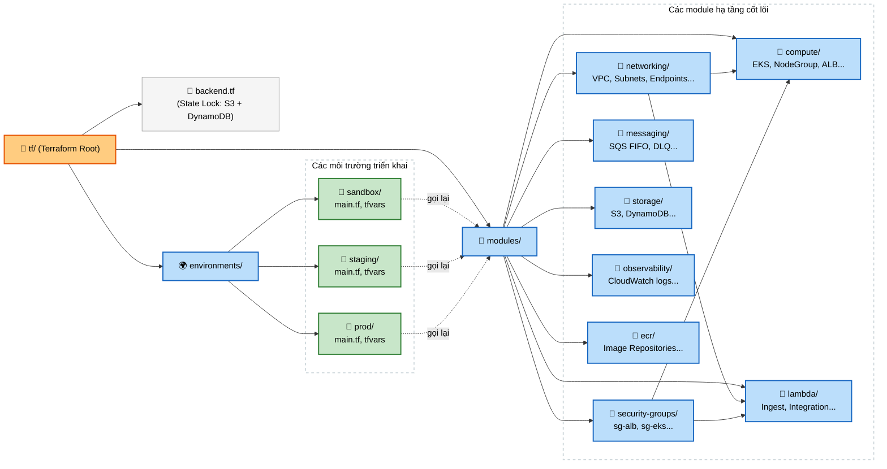

Để chuẩn bị tốt nhất trước khi bắt tay vào cấu hình hạ tầng Terraform cho dự án [TF1 Triage Hub](https://github.com/Auzema/Task_Xbrain/blob/main/deployment_plan.md), dưới đây là bản thông tin tổng hợp toàn bộ các yêu cầu cấu hình cốt lõi thuộc **Milestone 1 (Infrastructure)** được bóc tách và hệ thống hóa lại rõ ràng.

---

## 📋 Bản Thông Tin Cấu Hình Hạ Tầng (Milestone 1 Specification)

### 1. Quy Ước Bắt Buộc Theo AI Contract

> ⚠️ **Lưu ý đặc biệt:** Các thông số này được fix cứng theo cấu trúc hệ thống chung, tuyệt đối không thay đổi thông tin này trong code Terraform để tránh lỗi tích hợp giữa các thành phần.

| Tham số | Giá trị bắt buộc |
| --- | --- |
| **Region** | **us-east-1** |
| **AI Engine Namespace** | `tf1-aiops` |
| **AI Engine Service Name** | `tf1-ai-triage-engine` |
| **AI Engine Port** | **8080** |
| **Secret Path (Secrets Manager)** | `tf1/ai-engine/service-auth-token` |
| **Custom Headers** | `X-Tenant-Id`, `X-Correlation-Id` |
| **Endpoints dịch vụ** | `/healthz`, `/v1/triage` |

---

### 2. Chi Tiết Thành Phần Các Module Hạ Tầng

#### 🔑 2.1. Quản Lý Trạng Thái: Terraform State Backend (Task 1.1)

| Thành phần | Thuộc tính | Giá trị / Cấu hình yêu cầu |
| --- | --- | --- |
| **S3 Bucket** | Tên (Gợi ý) | `tf1-cdo05-tfstate` (phải globally unique) |
| | Versioning | Bật (Enabled) để rollback state |
| | Mã hóa (Encryption) | SSE-S3 (Môi trường Dev) / SSE-KMS (Môi trường Prod) |
| | Bảo mật truy cập | Block all public access |
| **DynamoDB Table** | Tên (Gợi ý) | `tf1-cdo05-tflock` |
| | Partition Key | Tên: `LockID` - Kiểu dữ liệu: **String** |
| | Chức năng | Cơ chế khóa state (State Lock) tránh conflict khi apply đồng thời |

#### 🌐 2.2. Mạng & Tường Lửa: VPC & Security Groups (Task 1.2 & 1.3)

| Thành phần | Thuộc tính | Giá trị / Cấu hình yêu cầu |
| --- | --- | --- |
| **VPC** | CIDR Block | Tự chọn (ví dụ: `10.0.0.0/16`) |
| **Internet Gateway** | Chức năng | Bắt buộc có (IGW) để kết nối Public Subnet ra Internet |
| **Subnets** | Cấu trúc phân bổ | **3 Availability Zones (AZs)** (đảm bảo High Availability) |
| | Public Subnet | Chứa Application Load Balancer (ALB) công khai và NAT Gateway |
| | Private Subnet | Chứa EKS Worker Nodes, Lambda ENI, xử lý nội bộ |
| **Route Tables** | Public Route | Trỏ `0.0.0.0/0` ra Internet Gateway (IGW) |
| | Private Route | Trỏ `0.0.0.0/0` ra NAT Gateway |
| **VPC Endpoints**| Gateway type | `S3`, `DynamoDB` |
| | Interface type | `SQS`, `ECR` (api & dkr), `CloudWatch Logs`, `STS` (phục vụ IRSA), `Secrets Manager` |
| **Security Groups**| `sg-alb` | **Inbound**: Port TCP 443 từ `0.0.0.0/0`<br/>**Outbound**: Giới hạn tới `sg-eks-nodes` |
| | `sg-eks-nodes` | **Inbound**: Từ `sg-alb` và EKS Control Plane<br/>**Outbound**: Mở toàn bộ (All) |
| | `sg-lambda` | **Inbound**: Không nhận traffic<br/>**Outbound**: Giới hạn tới VPC Endpoints (`SQS`, `DynamoDB`, `S3`) |
| | `sg-vpc-endpoints`| **Inbound**: Port TCP 443 từ `sg-eks-nodes` và `sg-lambda` |

#### 🐳 2.3. Lực Lượng Tính Toán: EKS Cluster & Lambda (Task 1.4 & 1.8)

| Thành phần | Thuộc tính | Giá trị / Cấu hình yêu cầu |
| --- | --- | --- |
| **EKS Cluster** | Phiên bản (Version)| Tối thiểu **1.30+** (nằm hoàn toàn trong Private Subnets) |
| | Tính năng bắt buộc | - Kích hoạt **OIDC Provider** (để cấu hình IRSA)<br/>- Bật **EKS Audit Logging** đồng bộ về CloudWatch Logs |
| **Node Group** | Instance Type | `t3.medium` hoặc `t3.large` |
| | Auto-scaling | Desired: **2** / Min: **2** / Max: **4** |
| | IAM Policies | `AmazonEKSWorkerNodePolicy`, `AmazonEKS_CNI_Policy`, `AmazonEC2ContainerRegistryReadOnly` |
| **K8s Add-ons** | Cài đặt bằng Helm / TF| `vpc-cni`, `coredns`, `kube-proxy`, `aws-ebs-csi-driver`, `AWS Load Balancer Controller` |
| **Lambda** | `tf1-ingest-lambda` | - Runtime: Python 3.12 / Node.js 20<br/>- Vị trí: Private subnet<br/>- Trigger: **API Gateway** hoặc **Function URL** (nhận webhook HTTPS)<br/>- Timeout: **30s**<br/>- Memory: **256MB**<br/>- Môi trường (Env): `SQS_QUEUE_URL`, `ENVIRONMENT` |
| | `tf1-integration-lambda`| - Runtime: Python 3.12 / Node.js 20<br/>- IAM: Quyền đọc ghi tới DynamoDB, S3 và đọc token từ Secrets Manager |

#### 📦 2.4. Lưu Trữ & Hàng Đợi (Task 1.5, 1.6 & 1.7)

| Thành phần | Thuộc tính | Giá trị / Cấu hình yêu cầu |
| --- | --- | --- |
| **SQS Queues** | Queue chính | Tên: `tf1-alert-queue.fifo` (Bắt buộc đuôi `.fifo`)<br/>- Visibility timeout: **300s**<br/>- Message retention: **4 ngày**<br/>- Deduplication: Kích hoạt (Content-based)<br/>- Mã hóa: Kích hoạt (SSE)<br/>- Redrive policy: Chuyển qua DLQ khi lỗi quá **3 lần** (`maxReceiveCount = 3`) |
| | Dead Letter Queue | Tên: `tf1-alert-dlq.fifo`<br/>- Message retention: **14 ngày** (phục vụ debug) |
| **DynamoDB** | Table Name | `incident_state` |
| | Partition Key | Tên: `incident_id` (Kiểu: **String**) |
| | Global Secondary Index | Bắt buộc tạo **GSI** trên trường `correlation_key` và `alert_fingerprint` |
| | Chế độ tính phí | **On-demand capacity mode** (tự động co giãn theo request) |
| | Bảo mật & Vận hành | - Bật tự hủy bản ghi **TTL** qua trường `expires_at`<br/>- Bật sao lưu **PITR** (Point-in-time recovery)<br/>- Kích hoạt mã hóa |
| **S3 Bucket** | Audit Bucket | Tên: `tf1-audit-{account-id}` |
| | Format Object Key | `{tenant_id}/{service}/{incident_id}/{artifact_type}` |
| | Cấu hình bảo mật | - Bật **Versioning**<br/>- Lifecycle Rule: Chuyển sang **Glacier sau 90 ngày**<br/>- Chặn hoàn toàn Public Access<br/>- Bucket Policy: TỪ CHỐI mọi kết nối không mã hóa TLS (`aws:SecureTransport = "false"`) |


---

#### 📈 2.5. Giám Sát AWS (CloudWatch & SNS) - Thuộc Task 1.10

Hệ thống K8s Monitoring (Prometheus/Grafana) sẽ do ArgoCD lo ở M2, nhưng các dịch vụ AWS managed (Lambda, SQS, DynamoDB) thì **phải dùng Terraform để cài đặt cảnh báo (Alarms) ngay trong M1**.

| Thành phần | Thuộc tính | Giá trị / Cấu hình yêu cầu |
| --- | --- | --- |
| **SNS Topic** | Tên | `tf1-alerts` (Subscribe Slack webhook vào đây) |
| **CloudWatch Log Groups** | Retention | Set cứng **14 ngày** cho các log group của Lambda |
| **CloudWatch Alarms** | Lambda | - **Errors**: > 5 lỗi / 5 phút<br/>- **Duration**: p99 > 10s |
| | SQS | - **Queue Depth**: > 100 tin nhắn<br/>- **DLQ Count**: > 0 (Mức độ CRITICAL) |
| | DynamoDB | - **Throttles**: > 0 |
| | S3 | - **Errors**: > 10 lỗi (4xx/5xx) |

#### 🐳 2.6. Container Registry (ECR) - Thuộc Task 2.6

Mặc dù ECR phục vụ cho CI/CD (Milestone 2), nhưng bắt buộc phải **tạo bằng Terraform** trong Milestone 1 để pipeline có nơi đẩy image lên.

| Thành phần | Thuộc tính | Giá trị / Cấu hình yêu cầu |
| --- | --- | --- |
| **ECR Repositories** | Tên Repos | Tạo 4 repo:<br/>- `tf1/ingest-lambda`<br/>- `tf1/correlator-worker`<br/>- `tf1/ai-engine`<br/>- `tf1/integration-lambda` |
| | Security | Bật **Image scanning on push** |
| | Tagging | Bật **Tag immutability** (không cho phép ghi đè tag) |
| | Lifecycle Policy | Giữ 10 images gần nhất, tự động xóa untagged images sau **7 ngày** |

---

### 3. Gợi Ý Tổ Chức Thư Mục Mã Nguồn Terraform

Để code chạy trơn tru, dễ bảo trì và phân tách rõ ràng trách nhiệm giữa các tài nguyên, cấu trúc thư mục dạng module hóa dưới đây là giải pháp tối ưu nhất:

```text
terraform/
├── modules/
│   ├── networking/      # VPC, Subnets, IGW, Route Tables, NAT, VPC Endpoints
│   ├── security/        # Security Groups, IAM Roles (IRSA cơ bản)
│   ├── compute/         # EKS Cluster, Node Groups, K8s Add-ons
│   ├── lambda/          # Các Lambda functions, API Gateway/Function URL trigger
│   ├── data/            # DynamoDB (kèm GSI), S3 (kèm Lifecycle/Policy)
│   ├── integration/     # SQS FIFO, DLQ
│   ├── observability/   # ✨ BỔ SUNG: CloudWatch Alarms, SNS Topic, Log Groups retention
│   └── ecr/             # ✨ BỔ SUNG: 4 ECR Repositories, Lifecycle, Scanning
└── environments/
    └── sandbox/         # Chứa main.tf, variables.tf để gọi các module trên và file backend.tf
```

Bản tổng hợp thông tin này đã gom đủ toàn bộ "nguyên liệu" kỹ thuật số cần thiết cho Milestone 1. Bạn có thể dựa vào khung đặc tả này để tự tin triển khai code Terraform một cách chính xác và đồng bộ nhất.