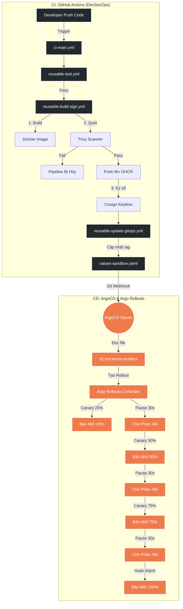

# Tổng quan Kiến trúc CI/CD & Progressive Delivery

Tài liệu này tổng hợp toàn bộ luồng luân chuyển mã nguồn từ lúc lập trình viên Push code cho đến khi tới tay người dùng cuối, áp dụng đầy đủ các tiêu chuẩn DevSecOps và Zero-Downtime Deployment.

---

## 1. Sơ đồ Luồng Hoạt Động (Overview Flow)

---

## 2. Kiến trúc CI (Mô hình Modular Workflows)

Thay vì một file CI khổng lồ, dự án áp dụng mô hình **Reusable Workflows** để dễ dàng bảo trì và mở rộng:

1. **`ci-main.yml`**: Trái tim điều phối. Kích hoạt khi có thay đổi trong thư mục `app/`. Gọi tuần tự các file con.
2. **`reusable-test.yml`**: Chạy Unit Test và Lint (cú pháp). Cắt đứt pipeline nếu code dỏm.
3. **`reusable-build-sign.yml`**:
   - **Trivy:** Quét mã độc trong thư viện HĐH và ngôn ngữ.
   - **GHCR:** Lưu trữ Image miễn phí không giới hạn.
   - **Cosign Keyless:** Sử dụng OIDC Token của Github để ký điện tử (Chứng thực nguồn gốc) mà không cần rủi ro lưu trữ Private Key.
4. **`reusable-update-gitops.yml`**: Dùng `sed` cập nhật image tag trong `values-sandbox.yaml` và tự động Commit.

---

## 3. Kiến trúc CD (App of Apps & Multiple Sources)

Mọi thứ trong K8s được khai báo (Declarative) ở thư mục `tf1-triage-hub/cd/`.

- **Lệnh Bootstrap Duy Nhất:** `kubectl apply -f bootstrap.yaml`. Từ đây, ArgoCD sẽ tự đẻ ra các tài nguyên khác.
- **Wave 0 (Nền móng):** `00-foundation`, `00-gatekeeper` (Bảo vệ K8s bằng luật OPA), và `00-rollouts` (Cài đặt Argo Rollouts Controller).
- **Wave 1 (Ứng dụng):** `01-backend`. Triển khai Backend.

---

## 4. Progressive Delivery (Triển khai Nhỏ Giọt)

Ứng dụng Backend không còn dùng K8s Deployment thông thường mà đã được nâng cấp lên **Rollout Custom Resource**.

### Chiến lược được sử dụng: Canary (25-50-75-100)
- Bước 1: 25% traffic vào bản mới (Chờ 30 giây)
- Bước 2: 50% traffic vào bản mới (Chờ 30 giây)
- Bước 3: 75% traffic vào bản mới (Chờ 30 giây)
- Bước 4: 100% traffic (Bản cũ bị hủy đi).

**Ưu điểm:** Nếu bước 25% bị Crash (sập), Argo Rollouts sẽ tự động ngừng lại và trả traffic về bản cũ. Giúp người dùng hoàn toàn không cảm nhận được lỗi, đạt chuẩn **Zero Downtime**.
