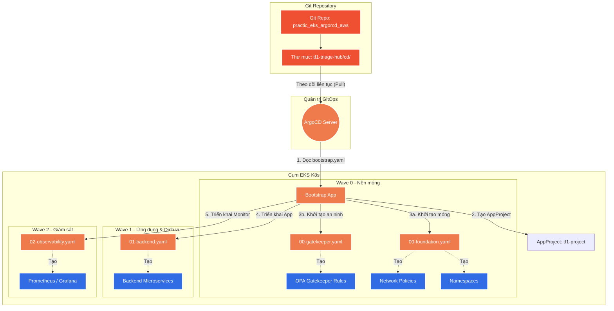

# Phân tích chi tiết CI/CD Pipeline (GitHub Actions)

Tài liệu này giải thích chi tiết các workflow GitHub Actions cho dự án, giúp bạn hiểu rõ từng bước tự động hóa khi có code mới được đẩy lên repository.

Chúng ta sẽ có 2 workflow chính:
1. **Application CI Pipeline**: Chạy test, quét bảo mật (Trivy), build Docker image và đẩy lên ECR.
2. **Terraform CI Pipeline**: Tự động chạy `terraform plan` và `apply` khi thay đổi hạ tầng.

---

## 1. Application CI Pipeline (`.github/workflows/ci-build-test.yml`)

Workflow này tự động chạy khi bạn tạo Pull Request hoặc push code vào nhánh `main`, `develop`.

```yaml
name: CI/CD Pipeline - Application

on:
  push:
    branches: [ "main", "develop" ]
  pull_request:
    branches: [ "main", "develop" ]

env:
  AWS_REGION: us-east-1
  ECR_REPOSITORY: tf1/ai-engine

# Yêu cầu quyền cần thiết để sử dụng OIDC (bảo mật, không dùng static AWS_ACCESS_KEY_ID)
permissions:
  id-token: write
  contents: read

jobs:
  build-and-test:
    name: Build, Test & Scan
    runs-on: ubuntu-latest

    steps:
    - name: Checkout Code
      uses: actions/checkout@v3

    # 1. Quét Secret trước tiên (Tránh lộ key AWS/Jira)
    - name: Gitleaks Secret Scan
      uses: gitleaks/gitleaks-action@v2
      env:
        GITHUB_TOKEN: ${{ secrets.GITHUB_TOKEN }}

    # 2. Xác thực với AWS qua OIDC
    - name: Configure AWS credentials
      uses: aws-actions/configure-aws-credentials@v3
      with:
        role-to-assume: arn:aws:iam::ACCOUNT_ID:role/GitHubActionsRole
        aws-region: ${{ env.AWS_REGION }}

    # 3. Đăng nhập vào Amazon ECR
    - name: Login to Amazon ECR
      id: login-ecr
      uses: aws-actions/amazon-ecr-login@v1

    # 4. Chạy Unit Test (Ví dụ cho Python)
    - name: Set up Python
      uses: actions/setup-python@v4
      with:
        python-version: '3.12'
    - name: Run Tests
      run: |
        pip install pytest
        pytest ./tests/

    # 5. Build Docker Image (Chỉ build, chưa push)
    - name: Build Docker Image
      env:
        REGISTRY: ${{ steps.login-ecr.outputs.registry }}
        IMAGE_TAG: ${{ github.sha }}
      run: |
        docker build -t $REGISTRY/$ECR_REPOSITORY:$IMAGE_TAG .
        
    # 6. Quét lỗ hổng (Vulnerabilities) trên Image vừa build bằng Trivy
    - name: Run Trivy vulnerability scanner
      uses: aquasecurity/trivy-action@master
      with:
        image-ref: '${{ steps.login-ecr.outputs.registry }}/${{ env.ECR_REPOSITORY }}:${{ github.sha }}'
        format: 'table'
        exit-code: '1' # Sẽ dừng CI nếu phát hiện lỗi CRITICAL
        ignore-unfixed: true
        vuln-type: 'os,library'
        severity: 'CRITICAL,HIGH'

    # 7. Push Image lên ECR (Chỉ khi merge hoặc push lên branch chính)
    - name: Push Image to ECR
      if: github.event_name == 'push'
      env:
        REGISTRY: ${{ steps.login-ecr.outputs.registry }}
        IMAGE_TAG: ${{ github.sha }}
      run: |
        docker push $REGISTRY/$ECR_REPOSITORY:$IMAGE_TAG

    # 8. Cập nhật Kustomize Image tag để trigger ArgoCD Deploy
    - name: Update ArgoCD Manifests
      if: github.event_name == 'push'
      run: |
        # Script để đổi giá trị image tag trong file kustomization.yaml
        cd config-repo/overlays/sandbox
        kustomize edit set image tf1-ai-engine=$REGISTRY/$ECR_REPOSITORY:$IMAGE_TAG
        git commit -am "Update image to ${{ github.sha }}"
        git push origin main
```

**Giải thích chi tiết:**
- `permissions: id-token: write`: Rất quan trọng! Cho phép GitHub Action lấy token OIDC để đổi lấy `Temporary Credentials` từ AWS IAM Role (`GitHubActionsRole`), loại bỏ hoàn toàn rủi ro lộ secret (như `AWS_SECRET_ACCESS_KEY`).
- Bước **Gitleaks**: Quét toàn bộ code vừa commit xem có lỡ push password/token nào lên không. Nếu có, CI sẽ `Failed` ngay lập tức.
- Bước **Run Trivy**: Quét Docker Image vừa build. Cờ `exit-code: '1'` và `severity: 'CRITICAL,HIGH'` nghĩa là nếu có bất kỳ lỗ hổng bảo mật mức độ Nghiêm trọng/Cao nào, pipeline sẽ báo đỏ và chặn không cho deploy.
- Bước **Update ArgoCD Manifests**: Đây là phần lõi của GitOps. GitHub Action không tự deploy lên K8s. Nó chỉ sửa lại Image Tag trong file YAML ở một repo khác (Config Repo). Sau đó, **ArgoCD** (bên trong EKS cluster) sẽ tự động phát hiện thay đổi trên Git và tiến hành Pull cấu hình mới về để deploy.

---

## 2. Infrastructure CI Pipeline (`.github/workflows/ci-terraform.yml`)

Workflow này theo dõi thư mục `tf1-triage-hub/tf/`.

```yaml
name: CI/CD Pipeline - Terraform

on:
  pull_request:
    paths:
      - 'tf1-triage-hub/tf/**'
  push:
    branches: [ "main", "develop" ]
    paths:
      - 'tf1-triage-hub/tf/**'

permissions:
  id-token: write
  contents: read
  pull-requests: write # Để comment kết quả terraform plan vào PR

jobs:
  terraform-plan:
    name: Terraform Plan
    runs-on: ubuntu-latest
    if: github.event_name == 'pull_request'
    
    steps:
    - name: Checkout Code
      uses: actions/checkout@v3

    - name: Configure AWS credentials
      uses: aws-actions/configure-aws-credentials@v3
      with:
        role-to-assume: arn:aws:iam::ACCOUNT_ID:role/TerraformDeployRole
        aws-region: us-east-1

    - name: Setup Terraform
      uses: hashicorp/setup-terraform@v2
      with:
        terraform_version: 1.8.0

    - name: Terraform Init
      run: terraform init
      working-directory: tf1-triage-hub/tf/environments/sandbox

    - name: Terraform Format
      run: terraform fmt -check
      working-directory: tf1-triage-hub/tf

    - name: Terraform Validate
      run: terraform validate
      working-directory: tf1-triage-hub/tf/environments/sandbox

    - name: Terraform Plan
      id: plan
      run: terraform plan -no-color
      working-directory: tf1-triage-hub/tf/environments/sandbox

    # Đẩy output của `terraform plan` lên comment của PR để dễ review
    - name: Update Pull Request
      uses: actions/github-script@v6
      env:
        PLAN: "terraform\n${{ steps.plan.outputs.stdout }}"
      with:
        github-token: ${{ secrets.GITHUB_TOKEN }}
        script: |
          const output = `#### Terraform Plan 📖
          
          <details><summary>Show Plan</summary>
          
          \`\`\`\n
          ${process.env.PLAN}
          \`\`\`
          
          </details>`;
          github.rest.issues.createComment({
            issue_number: context.issue.number,
            owner: context.repo.owner,
            repo: context.repo.repo,
            body: output
          })

  terraform-apply:
    name: Terraform Apply
    runs-on: ubuntu-latest
    # Chỉ chạy khi Merge PR vào main/develop
    if: github.event_name == 'push' 
    
    steps:
    - name: Checkout Code
      uses: actions/checkout@v3

    - name: Configure AWS credentials
      uses: aws-actions/configure-aws-credentials@v3
      with:
        role-to-assume: arn:aws:iam::ACCOUNT_ID:role/TerraformDeployRole
        aws-region: us-east-1

    - name: Setup Terraform
      uses: hashicorp/setup-terraform@v2

    - name: Terraform Init
      run: terraform init
      working-directory: tf1-triage-hub/tf/environments/sandbox

    - name: Terraform Apply
      run: terraform apply -auto-approve
      working-directory: tf1-triage-hub/tf/environments/sandbox
```

**Giải thích chi tiết:**
- `paths: ['tf1-triage-hub/tf/**']`: Giúp tiết kiệm chi phí chạy CI. Action này CHỈ chạy khi có ai đó sửa code hạ tầng Terraform. Nếu sửa code app, nó sẽ không chạy.
- Job **terraform-plan**: Chạy khi bạn mở PR. Tính năng thú vị nhất là bước `Update Pull Request` sử dụng `github-script`. Nó sẽ lấy output của lệnh `terraform plan` và tự động post thành một comment trên PR của bạn. Người review sẽ thấy rõ hạ tầng chuẩn bị thay đổi những gì mà không cần phải chạy code trên máy local.
- Job **terraform-apply**: Chạy khi PR được Merge. Bước `terraform apply -auto-approve` sẽ tự động triển khai hạ tầng thật trên AWS.
# Tổng quan Kiến trúc Continuous Deployment (CD) - TF1 Triage Hub

Tài liệu này tổng hợp toàn bộ kiến trúc triển khai liên tục (CD) đang được sử dụng trong dự án, dựa trên sức mạnh của **ArgoCD**, **Helm** và **GitOps**.

---

## 1. Sơ đồ luồng hoạt động (Overview Flow)

Sơ đồ dưới đây mô tả cách mã nguồn và cấu hình từ Git được ArgoCD kéo về và triển khai vào cụm Kubernetes theo một trình tự nghiêm ngặt (Sync Waves).



---

## 2. Cấu trúc thư mục CD

Toàn bộ cấu hình K8s nằm trong thư mục `tf1-triage-hub/cd/`. Chúng tôi áp dụng mô hình **App of Apps** và **Multiple Sources** (từ ArgoCD v2.6+).

```text
tf1-triage-hub/cd/
├── bootstrap.yaml               # Ứng dụng Mẹ (Root App) - Điểm bắt đầu duy nhất
├── argocd-apps/                 # Thư mục chứa định nghĩa các Ứng dụng Con
│   ├── tf1-project.yaml         # Thiết lập ranh giới bảo mật (AppProject)
│   ├── 00-foundation.yaml       # (Wave 0) Namespaces, NetworkPolicy, Secret Stores
│   ├── 00-gatekeeper.yaml       # (Wave 0) OPA Gatekeeper - Admission Controller
│   ├── 01-backend.yaml          # (Wave 1) Backend Microservices
│   └── 02-observability.yaml    # (Wave 2) Prometheus & Grafana
└── components/                  # Thư mục chứa cấu hình Helm/YAML chi tiết
    ├── foundation/
    ├── gatekeeper/
    ├── backend/
    └── observability/
```

---

## 3. Giải thích chi tiết từng lệnh và thành phần

### 3.1. Lệnh Bootstrapping (Gieo hạt giống)

**Lệnh duy nhất bạn cần chạy:**
```bash
kubectl apply -f tf1-triage-hub/cd/bootstrap.yaml
```
- **Ý nghĩa:** Lệnh này tạo ra một ArgoCD `Application` tên là `tf1-root-app`. Từ khoảnh khắc này, bạn không cần dùng `kubectl apply` thêm bất cứ lần nào nữa. `tf1-root-app` sẽ tự động đọc thư mục `argocd-apps/` và tự động đẻ ra các ứng dụng con bên trong.

### 3.2. Thành phần: AppProject (`tf1-project.yaml`)
- **Vai trò:** Là hàng rào bảo vệ (Security boundary) của ArgoCD.
- **Tính năng:** Nó quy định các ứng dụng con chỉ được phép lấy mã nguồn từ Github của bạn (`sourceRepos`), và chỉ được phép deploy vào cụm K8s nội bộ (`destinations`). Nó ngăn chặn việc ai đó cấu hình ArgoCD tải mã nguồn độc hại từ bên ngoài.

### 3.3. Thành phần: Foundation (`00-foundation.yaml` - Wave 0)
- **Vai trò:** Đổ móng cho cụm K8s. Phải chạy thành công đầu tiên thì các App khác mới có chỗ để sống.
- **Chứa gì:**
  - `Namespaces`: Tạo các khu vực cách ly (ví dụ: `tf1-sandbox`).
  - `Network Policies`: Tường lửa (Ví dụ: `default-deny.yaml` khóa toàn bộ traffic giữa các pod để tăng tính bảo mật).
  - `External Secrets`: Cấu hình kết nối với AWS Secrets Manager để kéo mật khẩu.

### 3.4. Thành phần: OPA Gatekeeper (`00-gatekeeper.yaml` - Wave 0)
- **Vai trò:** Người gác cổng (Admission Controller). Nó thay thế cho Kyverno trước đây.
- **Cách thức hoạt động (Multiple Sources):**
  1. Nó tải mã nguồn Helm của Gatekeeper từ `https://open-policy-agent.github.io/gatekeeper/charts`.
  2. Nó tải các luật do bạn tự định nghĩa (Constraint & ConstraintTemplate) từ Git repo của bạn (thư mục `components/gatekeeper`).
  3. **Kết quả:** Bất kỳ ai cố gắng tạo một Pod thiếu nhãn (labels) bắt buộc, hoặc dùng image có tag `latest`, Gatekeeper sẽ lập tức từ chối và báo lỗi.

### 3.5. Thành phần: Backend (`01-backend.yaml` - Wave 1)
- **Vai trò:** Triển khai mã nguồn logic của ứng dụng.
- **Sự phụ thuộc:** Nằm ở Wave 1, nghĩa là nó sẽ chờ Wave 0 (Foundation & Gatekeeper) xanh lè (Healthy) thì nó mới bắt đầu chạy. Nếu Wave 0 lỗi, Wave 1 sẽ không bao giờ được deploy, tránh lỗi dây chuyền.

### 3.6. Thành phần: Observability (`02-observability.yaml` - Wave 2)
- **Vai trò:** Đôi mắt của hệ thống. Giám sát tài nguyên, log và cảnh báo.
- **Cấu hình (Multiple Sources):**
  - Kéo Helm chart `kube-prometheus-stack` khổng lồ từ kho cộng đồng.
  - Sử dụng file `components/observability/prometheus-values.yaml` của riêng bạn để ghi đè cấu hình (ví dụ: cấp ổ cứng 10GB, Ram 2GB, set mật khẩu Grafana admin).

---

## 4. Ưu điểm của kiến trúc này

1. **Khắc phục giới hạn Git:** Không cần commit mã nguồn khổng lồ (helm charts) của Prometheus hay Gatekeeper vào Git của công ty. Giữ Git Repo cực kỳ nhẹ và sạch sẽ.
2. **Tuân thủ GitOps 100%:** Bất kỳ thay đổi nào (thêm namespace, đổi biến môi trường backend, cấu hình cảnh báo) đều phải thông qua Pull Request trên Git. Kỹ sư không được phép sửa trực tiếp trên K8s.
3. **Phục hồi thảm họa (Disaster Recovery):** Nếu cụm EKS bị sập hoàn toàn, chỉ cần dựng cụm mới, cài ArgoCD và chạy lại 1 lệnh `kubectl apply -f bootstrap.yaml`. Toàn bộ hệ thống hàng trăm pods sẽ tự phục hồi lại chính xác như cũ trong vòng vài phút.
# Giải thích cơ chế Override của Helm trong ArgoCD

Tài liệu này giải thích cách chúng ta đã tổ chức cấu trúc thư mục CD sử dụng **Helm**, và cơ chế giúp chúng ta cấu hình riêng biệt cho từng môi trường (sandbox, staging, prod) mà không cần phải copy lại toàn bộ manifest (DRY - Don't Repeat Yourself).

---

## 1. Cấu trúc thư mục Helm Chart hiện tại

Chúng ta đã thiết kế chuẩn Helm Chart tại đường dẫn `cd/components/app/`.

```text
cd/components/app/
├── Chart.yaml              # File khai báo metadata (siêu dữ liệu) của Helm Chart
├── templates/              # Thư mục chứa các "khuôn" YAML
│   ├── deployment.yaml     # Khuôn tạo ra Deployment
│   └── service.yaml        # Khuôn tạo ra Service
├── values.yaml             # File chứa các GIÁ TRỊ GỐC (Base values)
├── values-sandbox.yaml     # File GHI ĐÈ cho môi trường Sandbox
└── values-prod.yaml        # File GHI ĐÈ cho môi trường Production
```

Dưới đây là giải thích chi tiết cấu trúc, nội dung và tác dụng của từng file.

---

## 2. Phân tích chi tiết từng file và tác dụng

### 2.1. File `Chart.yaml`
**Tác dụng:** Đây là "chứng minh nhân dân" của thư mục ứng dụng. Khi có file này, thư mục `app` sẽ chính thức được ArgoCD và Helm nhận diện là một ứng dụng có thể triển khai (một Helm Chart).

**Cấu trúc bên trong:**
```yaml
apiVersion: v2             # Phiên bản chuẩn API của Helm 3
name: ai-engine            # Tên của Chart (ứng dụng)
description: A Helm chart for AI Engine Microservice # Mô tả
type: application          # Loại Chart là ứng dụng (chứ không phải thư viện library)
version: 1.0.0             # Phiên bản của cái Chart này
appVersion: "1.0.0"        # Phiên bản phần mềm chạy bên trong Chart
```

### 2.2. Thư mục `templates/`
Thư mục này chứa các file `.yaml` nhưng được viết bằng ngôn ngữ template của Go. Thay vì viết cứng thông số (hardcode), ta dùng ký hiệu `{{ ... }}` để chừa chỗ trống. Chỗ trống này sẽ được lấp đầy bằng các biến đọc từ file `values.yaml`.

#### A. File `templates/deployment.yaml`
**Tác dụng:** Đây là khuôn mẫu sinh ra Kubernetes Deployment. Deployment chịu trách nhiệm quản lý số lượng Pods, image chạy bên trong Pods, tài nguyên (CPU/RAM) cấp cho Pods và các biến môi trường của App.

**Cấu trúc quan trọng:**
```yaml
apiVersion: apps/v1
kind: Deployment
metadata:
  name: {{ .Chart.Name }}       # Tự động lấy "ai-engine" từ Chart.yaml
spec:
  replicas: {{ .Values.replicaCount }} # Lấy số lượng pod từ values.yaml
  template:
    spec:
      containers:
        - name: {{ .Chart.Name }}
          image: "{{ .Values.image.repository }}:{{ .Values.image.tag }}" # Ghép link Image và Tag
          resources:
            {{- toYaml .Values.resources | nindent 12 }} # Copy nguyên xi khối resources ở values.yaml vào đây
          env:
            # Đây là đoạn lặp cực kỳ mạnh mẽ của Helm.
            # Nó duyệt qua danh sách biến môi trường trong values.yaml và đẻ ra từng dòng - name / value
            {{- range $key, $val := .Values.env }}
            - name: {{ $key }}
              value: {{ $val | quote }}
            {{- end }}
```

#### B. File `templates/service.yaml`
**Tác dụng:** Sinh ra Kubernetes Service, dùng để mở port kết nối nội bộ hoặc ra bên ngoài cho các Pods thuộc Deployment phía trên.

**Cấu trúc quan trọng:**
```yaml
apiVersion: v1
kind: Service
metadata:
  name: {{ .Chart.Name }}
spec:
  type: {{ .Values.service.type }}   # Lấy kiểu mạng (ClusterIP, NodePort...)
  ports:
    - port: {{ .Values.service.port }} # Lấy port cần mở (Ví dụ: 8080)
```

---

### 2.3. Các file Values (Biến số)

Nhiệm vụ của Helm là bơm (inject) các giá trị vào trong các "chỗ trống" ở thư mục `templates`. Vậy giá trị đó lấy từ đâu? Chính là từ các file Values.

#### A. File Giá trị gốc: `values.yaml`
**Tác dụng:** Chứa **toàn bộ các cấu hình mặc định**. Đây là cấu hình chuẩn nhất của ứng dụng, thường dùng chung cho mọi môi trường.

**Cấu trúc bên trong:**
```yaml
replicaCount: 1                  # Mặc định chạy 1 pod

image:
  repository: tf1/ai-engine
  tag: "latest"                  # Mặc định dùng image mới nhất

service:
  type: ClusterIP                # Mặc định mạng nội bộ
  port: 8080

resources:                       # Tài nguyên mặc định (Nhẹ)
  requests:
    cpu: 100m
    memory: 128Mi
  limits:
    cpu: 200m
    memory: 256Mi

env:                             # Biến môi trường mặc định
  ENVIRONMENT: "default"
  LOG_LEVEL: "info"
```

#### B. File Ghi đè: `values-sandbox.yaml`
**Tác dụng:** Chứa các cấu hình **đặc thù chỉ dành cho Sandbox**. Bất cứ dòng nào xuất hiện ở file này sẽ đè nát dòng tương ứng ở file `values.yaml` gốc. Dòng nào KHÔNG CÓ thì sẽ dùng lại giá trị gốc.

**Cấu trúc bên trong:**
```yaml
# KHÔNG CẦN khai báo lại "image.repository" hay "service.type", Helm tự lấy từ values.yaml gốc.
# Chỉ ghi đè những gì khác biệt.

image:
  tag: "sandbox-a1b2c3d"         # Ghi đè tag riêng của code nhánh sandbox

resources:
  requests:
    cpu: 50m                     # Ép tài nguyên thấp xuống cho môi trường test
    memory: 64Mi

env:
  ENVIRONMENT: "sandbox"         # Ghi đè biến này
  DEBUG_MODE: "true"             # Thêm một biến HOÀN TOÀN MỚI chỉ Sandbox mới có
```

#### C. File Ghi đè: `values-prod.yaml`
**Tác dụng:** Tương tự Sandbox, nhưng dành cho Production (Thực tế).

**Cấu trúc bên trong:**
```yaml
replicaCount: 3                  # Bắt buộc tăng số Pod lên 3 để chịu lỗi

image:
  tag: "prod-x9y8z7w"            # Tag xịn đã qua kiểm duyệt

resources:
  requests:
    cpu: 500m                    # Cấp RAM/CPU siêu lớn
    memory: 512Mi

env:
  ENVIRONMENT: "prod"
  LOG_LEVEL: "error"             # Đổi log level để đỡ tốn dung lượng
```

---

## 3. Cách khai báo với ArgoCD

Sau khi đã hiểu bản chất từng file, để ArgoCD triển khai ứng dụng cho môi trường **Sandbox**, ta sẽ khai báo ở nơi khác (thường là trong App of Apps) cấu hình Application tương tự như sau:

```yaml
apiVersion: argoproj.io/v1alpha1
kind: Application
metadata:
  name: ai-engine-sandbox
spec:
  source:
    repoURL: https://github.com/NguyenKhanhDuy2703/pra_eks.git
    path: cd/components/app
    targetRevision: main
    helm:
      # BƯỚC QUAN TRỌNG: ArgoCD mặc định đọc `values.yaml`. 
      # Thuộc tính valueFiles dưới đây ép ArgoCD đọc thêm `values-sandbox.yaml` và merge chúng lại!
      valueFiles:
        - values-sandbox.yaml 
  destination:
    server: https://kubernetes.default.svc
    namespace: sandbox
```

Bằng cách đổi giá trị `valueFiles` thành `- values-prod.yaml` và namespace thành `prod`, bạn dễ dàng nhân bản ứng dụng ra vô số môi trường khác nhau mà vẫn đảm bảo mã nguồn CD tinh gọn tuyệt đối!
