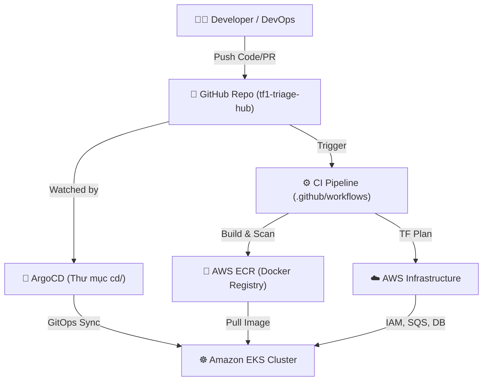

# 🚀 Hướng Dẫn Vận Hành Dự Án TF1 Triage Hub

Tài liệu này cung cấp cái nhìn toàn cảnh và chi tiết về cách vận hành hệ thống theo cấu trúc Monorepo đã khởi tạo. Dự án được chia làm 4 trụ cột chính: **App (Code)**, **CI (GitHub Actions)**, **CD (ArgoCD)** và **TF (Terraform)**.

---

## 1. Tổng quan Kiến Trúc Monorepo

---

## 2. Chi Tiết Vận Hành Từng Thành Phần

### 🅰️ Phần 1: Hạ tầng AWS (Thư mục `tf/`)

Thư mục này định nghĩa toàn bộ hạ tầng đám mây (VPC, EKS, DynamoDB, SQS...) bằng Terraform.

**Quy trình vận hành:**
1. **Thay đổi hạ tầng**: Bất kỳ khi nào cần thêm resource (VD: thêm S3 bucket), bạn **không** tạo bằng tay trên AWS Console. Hãy viết mã Terraform vào thư mục `tf/modules/` tương ứng.
2. **Kế thừa qua Environments**: Khai báo resource mới vào module, sau đó gọi module đó tại `tf/environments/sandbox/main.tf` (hoặc staging, prod) và truyền biến qua `terraform.tfvars`.
3. **Review (CI Terraform)**: Khi bạn tạo Pull Request, file `.github/workflows/ci-terraform.yml` sẽ tự động chạy lệnh `terraform plan` và hiển thị kết quả trực tiếp lên comment của PR.
4. **Áp dụng (Apply)**: 
   - **Sandbox / Staging**: Code merge vào nhánh `develop` sẽ được hệ thống tự động chạy `terraform apply`.
   - **Production**: Khi merge vào nhánh `main`, hệ thống bắt buộc phải có sự chấp thuận (Manual Approval) trên GitHub Actions trước khi `terraform apply` hạ tầng thật.

> Khuyến cáo: Mọi thay đổi đều được lưu lock (khóa) state qua S3 Backend và DynamoDB (`backend.tf`) để tránh tình trạng hai người cùng chạy Terraform apply một lúc gây hỏng hệ thống.

---

### 🅱️ Phần 2: Luồng CI Build & Test (Thư mục `.github/workflows/`)

Nơi quy định cách mã nguồn được kiểm thử và đóng gói.

**Quy trình vận hành:**
1. **Phát triển Code**: Developer viết code trong `app/services/ai-engine/` hoặc các lambda functions.
2. **Mở Pull Request**: GitHub Actions (`ci-build-test.yml`) sẽ tự động được kích hoạt để:
   - Chạy Unit Test / Integration Test.
   - Quét rò rỉ secret (bằng công cụ **Gitleaks**).
   - Build thử Docker image.
   - Quét lỗ hổng bảo mật Docker image (bằng công cụ **Trivy**). Nếu phát hiện lỗi `CRITICAL` hoặc `HIGH`, pipeline sẽ đánh fail (rớt) PR.
3. **Đóng gói và Phát hành**: Khi PR được merge, pipeline tự build Image thật, gán tag bằng đoạn mã hash Git (Git SHA) để định danh duy nhất (immutable) rồi push lên AWS ECR. Sau đó sẽ chạy `ci-image-sign.yml` để ký số image xác thực tính chính danh bằng Cosign.

---

### 🅲 Phần 3: Luồng CD Triển Khai GitOps (Thư mục `cd/`)

Sử dụng **ArgoCD** cài sẵn trên cụm Kubernetes EKS để lo việc cập nhật ứng dụng. **Bạn không cần gõ lệnh `kubectl apply` bằng tay.**

**Quy trình vận hành (Mô hình App of Apps):**
1. **Root Application**: ArgoCD chỉ cần biết duy nhất tới file `cd/root/app-of-apps.yaml`. File này hoạt động như "chỉ huy trưởng", quản lý các Apps con khác.
2. **Triển khai theo Làn Sóng (Sync Waves)**:
   - *Wave 0* (`00-foundation.yaml`): Triển khai các thứ nền tảng trước (Namespace, Network Policies, RBAC, SecretStores).
   - *Wave 1* (`01-app.yaml`): Triển khai các Workloads Backend thuần.
   - *Wave 2* (`02-ai-engine.yaml`): Triển khai AI Engine có hỗ trợ **Argo Rollouts** (chuyển traffic dần dần kiểu Canary: 10% → 50% → 100% dựa trên đo đạc Metrics từ Prometheus).
   - *Wave 4* (`03-observability.yaml`): Cài đặt hệ thống giám sát (Grafana, Alertmanager) ở bước cuối.
3. **Triển khai Code Mới**: 
   Khi CI đã đẩy Image lên ECR, CI sẽ dùng script tự động sửa file cấu hình `kustomization.yaml` tại thư mục `cd/components/app/overlays/sandbox/` để thay đổi `image tag` thành tag mới.
   ArgoCD phát hiện Git thay đổi -> tự động kéo manifest mới -> Apply lên EKS -> Ứng dụng được cập nhật không có thời gian downtime (Zero downtime).

---

### 🅳 Phần 4: Microservices (Thư mục `app/`)

Chứa mã nguồn gốc của BE, nơi developer làm việc 90% thời gian.

**Quy trình vận hành:**
- Mỗi thư mục con (`ai-engine/`, `ingest-lambda/`...) tương đương một service độc lập.
- Có `Dockerfile` và tệp phụ thuộc (`requirements.txt` hoặc `package.json`) riêng biệt.
- **Lưu ý Security**: KHÔNG hardcode Secrets trong mã nguồn. Mọi Token, API Keys đều phải được kéo từ **AWS Secrets Manager**, sau đó External Secrets Operator (ESO) bên phía ArgoCD (Wave 0) sẽ đồng bộ thành các Kubernetes Secrets để nhúng vào Pod chạy Code của bạn.

---

## 3. Nếu Xảy Ra Sự Cố (Troubleshooting)

| Tình Huống | Nơi Cần Kiểm Tra | Cách Khắc Phục |
| :--- | :--- | :--- |
| **Bị rớt Pipeline ở bước GitHub PR** | Bảng Log Actions trên GitHub. | Sửa code để pass unit test, hoặc xóa Secret bị lọt trong code theo cảnh báo của Gitleaks. |
| **Hạ tầng Terraform tạo bị lỗi** | Tab Actions > `ci-terraform`. | Kiểm tra file `main.tf` của môi trường bạn đang apply, có thể thiếu quyền IAM hoặc syntax lỗi. |
| **Pod không chạy, báo `ImagePullBackOff`** | ArgoCD UI hoặc chạy `kubectl describe pod`. | Kiểm tra IAM Role của Node Group có được cấp quyền `AmazonEC2ContainerRegistryReadOnly` kéo ECR không. |
| **AI Engine deploy nhưng báo lỗi 500** | ArgoCD UI (phần Argo Rollouts). | Hệ thống AnalysisTemplate sẽ tự check chỉ số Prometheus, nếu lỗi 500 tăng vọt, nó sẽ **TỰ ĐỘNG ROLLBACK** về bản cũ an toàn. Bạn cần debug code bản mới. |

---

> **Tóm tắt ngắn nhất dành cho Developer:**
> *"Code xong ở thư mục `app/` -> Tạo PR -> Đợi đèn xanh CI -> Merge -> Nghỉ uống cà phê, ArgoCD sẽ lo phần việc còn lại đem App lên EKS."*
# Sổ tay Kiến thức Kỹ thuật (DevOps / GitOps)

Tài liệu này tổng hợp lại các câu hỏi và khái niệm quan trọng đã được làm rõ trong quá trình xây dựng kiến trúc CI/CD bằng ArgoCD và Helm. Đây là cẩm nang giúp team hiểu rõ "Tại sao chúng ta lại làm như vậy".

---

## 1. Cơ chế của Helm và Kubernetes

### 1.1. Tại sao phải ghi đè biến môi trường (Environment Variables) cho từng nơi?
Thay vì viết một ứng dụng duy nhất chạy ở mọi nơi, ta cần biến môi trường để:
- **Phân tách dữ liệu:** Trỏ đúng về Database test (Sandbox) hoặc Database thật (Prod).
- **Bảo mật:** Sử dụng API Keys test và thật khác nhau để tránh mất tiền oan.
- **Tối ưu giám sát:** Bật `DEBUG_MODE` ở Sandbox để dễ tìm lỗi, nhưng hạ `LOG_LEVEL` xuống mức `error` ở Prod để tiết kiệm dung lượng ổ cứng.
- **Bật/Tắt tính năng (Feature Flags):** Cho phép tính năng mới chạy ẩn ở Sandbox trước khi mở cho khách hàng thật.

### 1.2. Mối quan hệ giữa Deployment và Service
- **Deployment ("Xưởng sản xuất"):** Quản lý các Pods (Container). Nó chịu trách nhiệm giữ cho ứng dụng luôn chạy đúng số lượng (`replicas`), tự động đẻ Pod mới nếu Pod cũ chết (Self-healing). Nó dùng `selector.matchLabels` để đếm số lượng Pod nó đang quản lý.
- **Service ("Cổng giao dịch"):** Pods thay đổi IP liên tục khi bị khởi động lại. Service cung cấp một IP và tên miền nội bộ tĩnh (không đổi) để các ứng dụng khác kết nối vào. Sau đó Service làm nhiệm vụ Load Balancer, tản đều lượng truy cập xuống các Pods sống đang được gắn nhãn tương ứng.

### 1.3. Biến `{{ .Values }}` và `{{ .Chart }}` lấy từ đâu ra?
Kubernetes không hiểu cú pháp `{{ }}`. Đây là "ma thuật" của **Helm (Go Template Engine)**:
1. Helm nạp file `Chart.yaml` vào bộ nhớ tạo thành đối tượng `.Chart`.
2. Helm nạp file `values.yaml` (và hợp nhất với `values-sandbox.yaml`) tạo thành đối tượng `.Values`.
3. Helm đi vào thư mục `templates/`, tìm các dấu `{{ }}` và gán chữ tương ứng vào.
4. Cuối cùng, sinh ra file YAML thuần túy 100% rồi mới nộp cho Kubernetes deploy.

### 1.4. Thiết kế Microservices bằng Helm (Chia để trị)
Nếu có nhiều ứng dụng (BE, FE, Worker), phương pháp chuẩn mực nhất là **tạo nhiều thư mục Helm Chart độc lập** (`components/backend`, `components/frontend`). 
Điều này giúp vòng đời CI/CD của từng dịch vụ tách biệt hoàn toàn, không sợ deploy ứng dụng này lại làm hỏng cấu hình của ứng dụng kia.

---

## 2. Kiến trúc ArgoCD & GitOps

### 2.1. Hạ tầng nền tảng (Foundation) & Sync Waves
- **Foundation** là những thứ dùng chung cho toàn cluster: Namespaces, External Secrets (kho mật khẩu), RBAC, NetworkPolicies.
- **Sync Waves** (Làn sóng đồng bộ): ArgoCD tuân thủ thứ tự chạy ưu tiên. 
  - `Wave 0`: Đọc file `00-foundation.yaml`, chạy đi xây móng (tạo namespace, kết nối AWS Secrets). 
  - `Wave 1`: Đọc file `01-backend.yaml` để deploy ứng dụng. Nếu không có móng (Wave 0), ứng dụng (Wave 1) sẽ sập ngay lập tức vì không tìm thấy Namespace.

### 2.2. Tại sao lại đánh số tên file (`00-`, `01-`)?
Mặc dù ArgoCD không quan tâm tên file, việc đánh số là Best Practice nhằm:
- Giúp con người (DevOps) nhìn vào là biết ngay thứ tự phụ thuộc (Cái 00 quan trọng hơn cái 01).
- Trùng khớp với logic của `Sync Wave`.
- Đề phòng khi Kỹ sư chạy tay bằng lệnh `kubectl apply -f folder/`, Kubernetes sẽ đọc theo thứ tự bảng chữ cái nên sẽ apply Foundation trước Backend, không gây lỗi rác.

### 2.3. AppProject (`tf1-project`) có vai trò gì?
`AppProject` là "Trạm kiểm lâm" bảo mật của ArgoCD:
- **`sourceRepos`**: Ngăn chặn lấy source code bậy bạ ngoài Internet, chỉ cho phép kéo code từ kho Git của công ty.
- **`destinations`**: Giới hạn việc deploy chỉ được nằm trong cụm K8s nội bộ và những namespace nhất định.
- **`clusterResourceWhitelist`**: Cho phép đẻ ra các tài nguyên cấp Cluster (như `Namespace` hoặc `ClusterRole`). Nếu không có dòng `group: "*", kind: "*"`, ArgoCD sẽ chặn đứng cụm Foundation vì sợ đụng chạm đến rễ của hệ thống.

---

## 3. Kubernetes Networking & Security

### 3.1. NetworkPolicy vs Ingress
Hai khái niệm này hoàn toàn khác nhau:
- **Ingress**: "Bác bảo vệ cổng chính". Hứng traffic từ ngoài Internet, giải mã SSL, đọc tên miền (ví dụ: `api.triagehub.com`) rồi dắt tay khách hàng vào đúng ứng dụng.
- **NetworkPolicy**: "Tường lửa nội bộ". Chặn các ứng dụng bên trong K8s âm thầm giao tiếp chui với nhau.

### 3.2. Sức mạnh của Default Deny NetworkPolicy
Luật `default-deny-all` sẽ chặn đứng MỌI kết nối (Cả Vào và Ra) đối với toàn bộ Pods trong một Namespace.
- Mức độ chặn là ở **cấp độ Pod**, thông qua giao diện mạng ảo (CNI).
- **Kết quả cực đoan nhưng an toàn:** Dù 2 Pods (Backend và Database) có nằm trên cùng 1 con Server vật lý (Worker Node), chúng vẫn **KHÔNG THỂ** gửi tin nhắn cho nhau vì hệ điều hành Linux Kernel đã chặt đứt kết nối ngay tại cửa ngõ của Pod.
- Từ luật chặn sạch này, kỹ sư DevOps sẽ từ từ đục những "lỗ hổng" siêu nhỏ (Allow list) chỉ đủ để các Pods cần thiết gọi được nhau, triệt tiêu hoàn toàn đường đi của Hacker nếu lỡ xâm nhập được 1 Pod.
