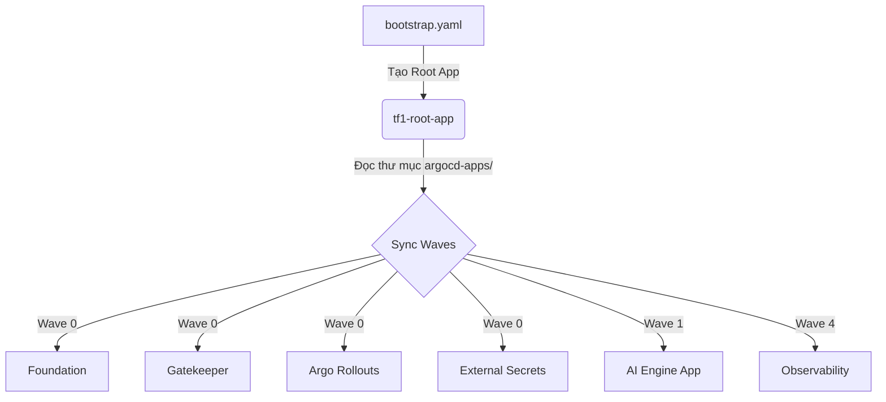

# 🌊 GitOps Flow & Hướng dẫn sử dụng ArgoCD

Tài liệu này mô tả chi tiết luồng hoạt động (flow) của GitOps thông qua ArgoCD và cách triển khai các ứng dụng nằm trong thư mục `tf1-triage-hub/cd/argocd-apps`.

---

## 1. Kiến trúc App of Apps
Dự án sử dụng pattern **"App of Apps"** của ArgoCD.
Thay vì apply từng file YAML thủ công, bạn chỉ cần apply duy nhất một file gốc (`bootstrap.yaml`). File này sẽ khai báo một Application "mẹ", có nhiệm vụ theo dõi toàn bộ thư mục `argocd-apps/` trong Git và tự động sinh ra các Application "con".



---

## 2. Trình tự triển khai (Sync Waves)
ArgoCD phân chia thứ tự cài đặt thông qua annotation `argocd.argoproj.io/sync-wave`. Các ứng dụng ở Wave nhỏ sẽ được cài đặt và chờ đến khi "Healthy" thì mới cài tiếp Wave lớn hơn.

### 🌊 Wave 0: Hạ tầng nền tảng (Platform Foundation)
Đây là các thành phần bắt buộc phải có trước khi bất kỳ ứng dụng nào được chạy.
- **`00-foundation.yaml`**: Khởi tạo Namespaces, Role-Based Access Control (RBAC), Network Policies và cấu hình SecretStore. Nguồn: thư mục `cd/components/foundation/`.
- **`00-gatekeeper.yaml`**: Cài đặt OPA Gatekeeper từ Helm chart chính thức để thực thi các chính sách bảo mật cho cluster.
- **`00-rollouts.yaml`**: Cài đặt Argo Rollouts Controller để hỗ trợ tính năng deploy Canary (chuyển traffic từ từ) cho các ứng dụng.
- **`00-external-secrets.yaml`**: Cài đặt External Secrets Operator (ESO) để tự động đồng bộ secret từ AWS Secrets Manager về cluster.

### 🌊 Wave 1: Các Microservices của dự án
- **`01-ai-engine.yaml`**: Cài đặt ứng dụng AI Engine Backend (FastAPI). Nguồn lấy từ `cd/components/app-chart` (sử dụng Helm).

### 🌊 Wave 4: Hệ thống giám sát (Observability)
- **`02-observability.yaml`**: Cài đặt Prometheus Stack, Grafana, Alertmanager. Nó được đẩy xuống Wave cuối cùng để đảm bảo hệ thống đã lên ổn định mới bắt đầu giám sát, tránh các cảnh báo giả (false alarms) trong lúc khởi tạo.

---

## 3. Cách triển khai (How to run)

### Bước 1: Cài đặt ArgoCD lên Cluster
Đảm bảo bạn đã cài đặt ArgoCD core lên EKS cluster của mình (chỉ làm 1 lần duy nhất):
```bash
kubectl create namespace argocd
kubectl apply -n argocd -f https://raw.githubusercontent.com/argoproj/argo-cd/stable/manifests/install.yaml
```

### Bước 2: Kích hoạt luồng GitOps
Chạy duy nhất lệnh sau từ thư mục gốc của repo:
```bash
kubectl apply -f tf1-triage-hub/cd/bootstrap.yaml
```

### Bước 3: Đăng nhập và kiểm tra trên UI
Chuyển port để truy cập giao diện ArgoCD:
```bash
kubectl port-forward svc/argocd-server -n argocd 8080:443
```
- Mở trình duyệt: `https://localhost:8080`
- User: `admin`
- Lấy password: `kubectl -n argocd get secret argocd-initial-admin-secret -o jsonpath="{.data.password}" | base64 -d`

Bạn sẽ thấy Application `tf1-root-app` màu xanh lá, và nó sẽ tự động đẻ ra các Application con theo đúng thứ tự Wave.

---

## 4. Luồng CI/CD (Developer Flow)
Khi Developer push code mới, luồng tích hợp với ArgoCD sẽ diễn ra như sau:

1. **Build & Push Image**: GitHub Actions (file `ci-main.yml`) chạy test, build Docker image và đẩy lên GitHub Container Registry (ghcr.io) với tag là mã Git SHA (ví dụ: `abcd123`).
2. **Update GitOps**: Job `update-gitops` tự động sửa file `values-sandbox.yaml` (hoặc `values-prod.yaml`), cập nhật dòng `image.tag: "abcd123"` và commit thẳng vào repo.
3. **ArgoCD Sync**: Định kỳ mỗi 3 phút (hoặc trigger ngay qua webhook), ArgoCD phát hiện thay đổi trong file `values-sandbox.yaml`. Nó sẽ lập tức kích hoạt Argo Rollouts để thực hiện chiến lược Canary update cho pod AI Engine mới trên cụm EKS.


