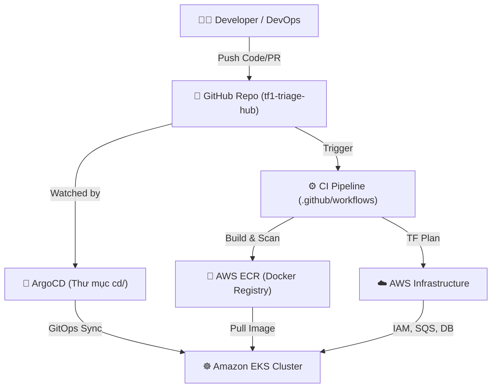

# 🚀 Hướng Dẫn Vận Hành Dự Án TF1 Triage Hub

Tài liệu này cung cấp cái nhìn toàn cảnh và chi tiết về cách vận hành hệ thống theo cấu trúc Monorepo đã khởi tạo. Dự án được chia làm 4 trụ cột chính: **App (Code)**, **CI (GitHub Actions)**, **CD (ArgoCD)** và **TF (Terraform)**.

---

## 1. Tổng quan Kiến Trúc Monorepo

---

## 2. Chi Tiết Vận Hành Từng Thành Phần

### 🅰️ Phần 1: Hạ tầng AWS (Thư mục `tf/`)

Thư mục này định nghĩa toàn bộ hạ tầng đám mây (VPC, EKS, DynamoDB, SQS...) bằng Terraform.

**Quy trình vận hành:**
1. **Thay đổi hạ tầng**: Bất kỳ khi nào cần thêm resource (VD: thêm S3 bucket), bạn **không** tạo bằng tay trên AWS Console. Hãy viết mã Terraform vào thư mục `tf/modules/` tương ứng.
2. **Kế thừa qua Environments**: Khai báo resource mới vào module, sau đó gọi module đó tại `tf/environments/sandbox/main.tf` (hoặc staging, prod) và truyền biến qua `terraform.tfvars`.
3. **Review (CI Terraform)**: Khi bạn tạo Pull Request, file `.github/workflows/ci-terraform.yml` sẽ tự động chạy lệnh `terraform plan` và hiển thị kết quả trực tiếp lên comment của PR.
4. **Áp dụng (Apply)**: 
   - **Sandbox / Staging**: Code merge vào nhánh `develop` sẽ được hệ thống tự động chạy `terraform apply`.
   - **Production**: Khi merge vào nhánh `main`, hệ thống bắt buộc phải có sự chấp thuận (Manual Approval) trên GitHub Actions trước khi `terraform apply` hạ tầng thật.

> Khuyến cáo: Mọi thay đổi đều được lưu lock (khóa) state qua S3 Backend và DynamoDB (`backend.tf`) để tránh tình trạng hai người cùng chạy Terraform apply một lúc gây hỏng hệ thống.

---

### 🅱️ Phần 2: Luồng CI Build & Test (Thư mục `.github/workflows/`)

Nơi quy định cách mã nguồn được kiểm thử và đóng gói.

**Quy trình vận hành:**
1. **Phát triển Code**: Developer viết code trong `app/services/ai-engine/` hoặc các lambda functions.
2. **Mở Pull Request**: GitHub Actions (`ci-build-test.yml`) sẽ tự động được kích hoạt để:
   - Chạy Unit Test / Integration Test.
   - Quét rò rỉ secret (bằng công cụ **Gitleaks**).
   - Build thử Docker image.
   - Quét lỗ hổng bảo mật Docker image (bằng công cụ **Trivy**). Nếu phát hiện lỗi `CRITICAL` hoặc `HIGH`, pipeline sẽ đánh fail (rớt) PR.
3. **Đóng gói và Phát hành**: Khi PR được merge, pipeline tự build Image thật, gán tag bằng đoạn mã hash Git (Git SHA) để định danh duy nhất (immutable) rồi push lên AWS ECR. Sau đó sẽ chạy `ci-image-sign.yml` để ký số image xác thực tính chính danh bằng Cosign.

---

### 🅲 Phần 3: Luồng CD Triển Khai GitOps (Thư mục `cd/`)

Sử dụng **ArgoCD** cài sẵn trên cụm Kubernetes EKS để lo việc cập nhật ứng dụng. **Bạn không cần gõ lệnh `kubectl apply` bằng tay.**

**Quy trình vận hành (Mô hình App of Apps):**
1. **Root Application**: ArgoCD chỉ cần biết duy nhất tới file `cd/root/app-of-apps.yaml`. File này hoạt động như "chỉ huy trưởng", quản lý các Apps con khác.
2. **Triển khai theo Làn Sóng (Sync Waves)**:
   - *Wave 0* (`00-foundation.yaml`): Triển khai các thứ nền tảng trước (Namespace, Network Policies, RBAC, SecretStores).
   - *Wave 1* (`01-app.yaml`): Triển khai các Workloads Backend thuần.
   - *Wave 2* (`02-ai-engine.yaml`): Triển khai AI Engine có hỗ trợ **Argo Rollouts** (chuyển traffic dần dần kiểu Canary: 10% → 50% → 100% dựa trên đo đạc Metrics từ Prometheus).
   - *Wave 4* (`03-observability.yaml`): Cài đặt hệ thống giám sát (Grafana, Alertmanager) ở bước cuối.
3. **Triển khai Code Mới**: 
   Khi CI đã đẩy Image lên ECR, CI sẽ dùng script tự động sửa file cấu hình `kustomization.yaml` tại thư mục `cd/components/app/overlays/sandbox/` để thay đổi `image tag` thành tag mới.
   ArgoCD phát hiện Git thay đổi -> tự động kéo manifest mới -> Apply lên EKS -> Ứng dụng được cập nhật không có thời gian downtime (Zero downtime).

---

### 🅳 Phần 4: Microservices (Thư mục `app/`)

Chứa mã nguồn gốc của BE, nơi developer làm việc 90% thời gian.

**Quy trình vận hành:**
- Mỗi thư mục con (`ai-engine/`, `ingest-lambda/`...) tương đương một service độc lập.
- Có `Dockerfile` và tệp phụ thuộc (`requirements.txt` hoặc `package.json`) riêng biệt.
- **Lưu ý Security**: KHÔNG hardcode Secrets trong mã nguồn. Mọi Token, API Keys đều phải được kéo từ **AWS Secrets Manager**, sau đó External Secrets Operator (ESO) bên phía ArgoCD (Wave 0) sẽ đồng bộ thành các Kubernetes Secrets để nhúng vào Pod chạy Code của bạn.

---

## 3. Nếu Xảy Ra Sự Cố (Troubleshooting)

| Tình Huống | Nơi Cần Kiểm Tra | Cách Khắc Phục |
| :--- | :--- | :--- |
| **Bị rớt Pipeline ở bước GitHub PR** | Bảng Log Actions trên GitHub. | Sửa code để pass unit test, hoặc xóa Secret bị lọt trong code theo cảnh báo của Gitleaks. |
| **Hạ tầng Terraform tạo bị lỗi** | Tab Actions > `ci-terraform`. | Kiểm tra file `main.tf` của môi trường bạn đang apply, có thể thiếu quyền IAM hoặc syntax lỗi. |
| **Pod không chạy, báo `ImagePullBackOff`** | ArgoCD UI hoặc chạy `kubectl describe pod`. | Kiểm tra IAM Role của Node Group có được cấp quyền `AmazonEC2ContainerRegistryReadOnly` kéo ECR không. |
| **AI Engine deploy nhưng báo lỗi 500** | ArgoCD UI (phần Argo Rollouts). | Hệ thống AnalysisTemplate sẽ tự check chỉ số Prometheus, nếu lỗi 500 tăng vọt, nó sẽ **TỰ ĐỘNG ROLLBACK** về bản cũ an toàn. Bạn cần debug code bản mới. |

---

> **Tóm tắt ngắn nhất dành cho Developer:**
> *"Code xong ở thư mục `app/` -> Tạo PR -> Đợi đèn xanh CI -> Merge -> Nghỉ uống cà phê, ArgoCD sẽ lo phần việc còn lại đem App lên EKS."*
